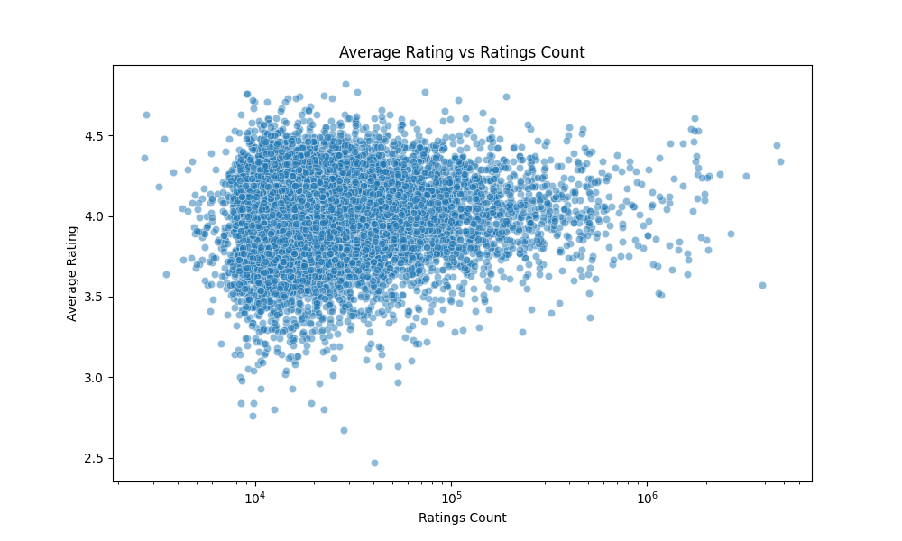
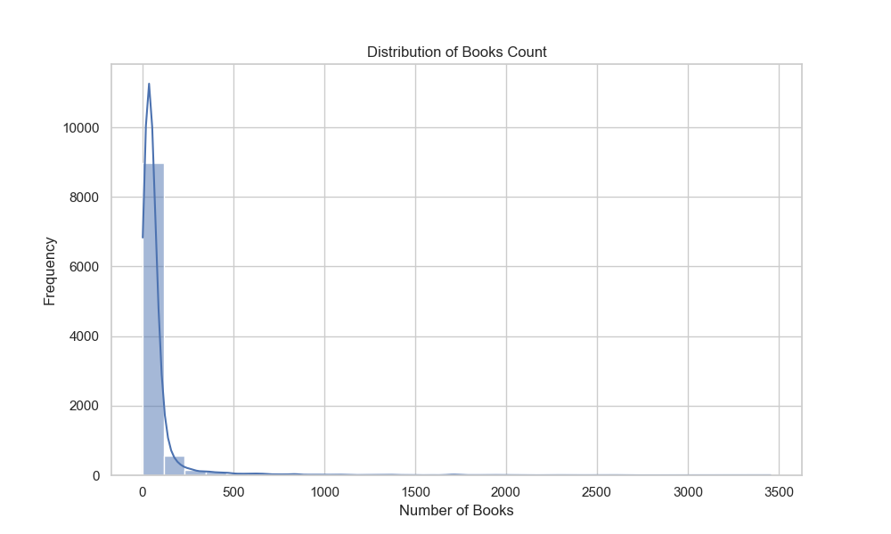
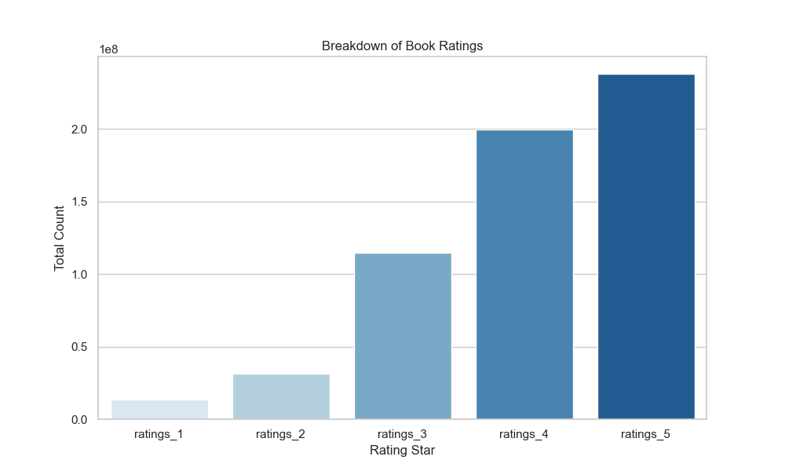
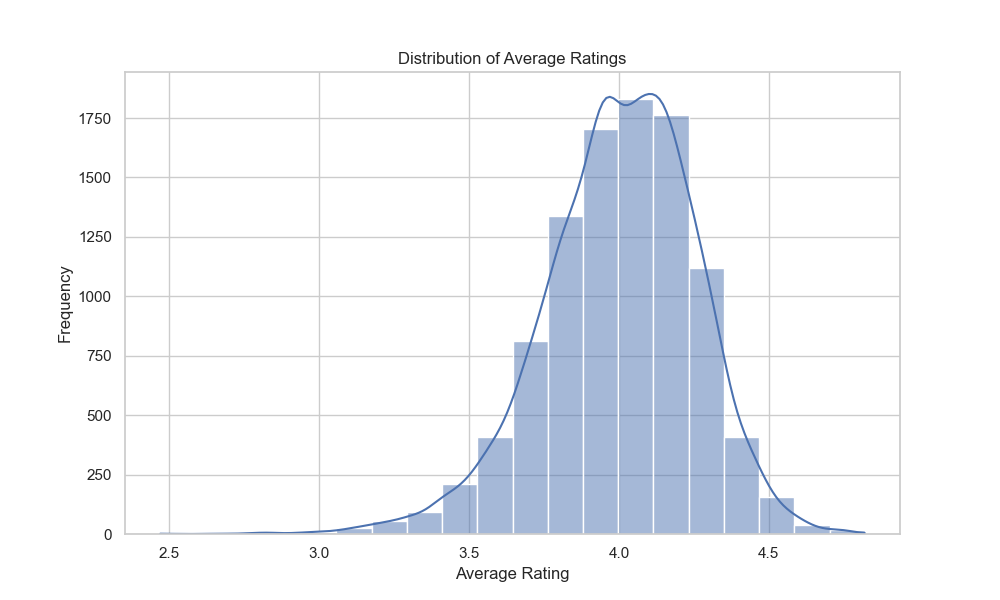
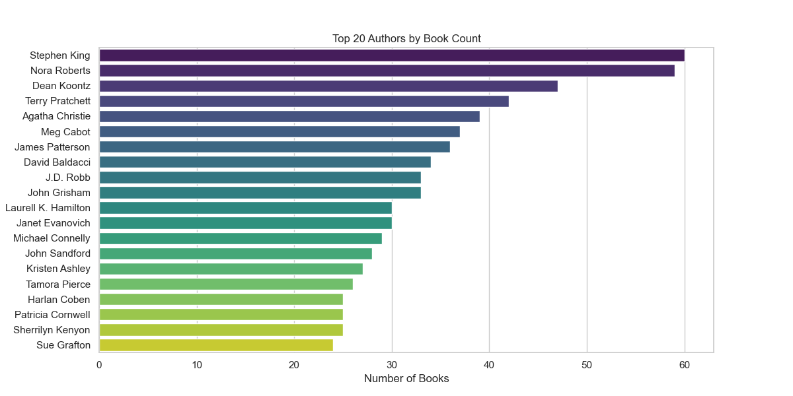
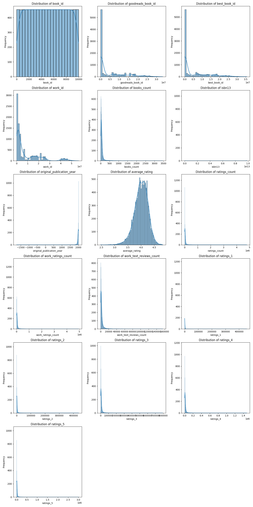

# 🤖 Automated Analysis Report

#### 📦 Column(s) Available 

`book_id`,`goodreads_book_id`,`best_book_id`,`work_id`,`books_count`,`isbn`,`isbn13`,`authors`,`original_publication_year`,`original_title`,`title`,`language_code`,`average_rating`,`ratings_count`,`work_ratings_count`,`work_text_reviews_count`,`ratings_1`,`ratings_2`,`ratings_3`,`ratings_4`,`ratings_5`,`image_url`,`small_image_url` 

#### 🪫 Column(s) with Missing Values 

|                           |    0 |
|:--------------------------|-----:|
| isbn                      |  700 |
| isbn13                    |  585 |
| original_publication_year |   21 |
| original_title            |  585 |
| language_code             | 1084 |

## 💡 Story
### 📚 Story of a Magical Library of Books

Once upon a time in the digital realm, there existed an enchanting dataset filled with 10,000 mesmerizing books. Each book came with its own tales and histories, recorded in a grand library for all bibliophiles to explore. This dataset gleamed with insights about authors, publication years, average ratings, and much more. Let’s embark on a journey to uncover the secrets hidden within this library! 🌟

---

#### 📊 Overview of the Dataset

| **Column Name**                    | **Description**                                                  | **Unique Values** | **Missing Values** |
|------------------------------------|------------------------------------------------------------------|-------------------|---------------------|
| **book_id**                        | Unique identifier for each book                                 | 10,000            | 0                   |
| **goodreads_book_id**              | Goodreads identifier for the book                               | 10,000            | 0                   |
| **best_book_id**                   | Best book's identifier on Goodreads                             | 10,000            | 0                   |
| **work_id**                        | Identifier for the book works                                   | 10,000            | 0                   |
| **books_count**                    | Number of books by the author                                   | 597               | 0                   |
| **isbn**                           | ISBN number of the book                                         | 9,300             | 700                 |
| **isbn13**                         | ISBN-13 number of the book                                      | 9,415             | 585                 |
| **authors**                        | Names of the authors                                            | 4,664             | 0                   |
| **original_publication_year**      | Year the book was originally published                         | 293               | 21                  |
| **original_title**                 | Title of the book before any editions                          | 9,274             | 585                 |
| **title**                          | Book's full title including series information                 | 9,964             | 0                   |
| **language_code**                  | Language in which the book is written                           | 25                | 1,084               |
| **average_rating**                 | Average rating of the book                                      | 184               | 0                   |
| **ratings_count**                  | Total number of ratings given                                   | 9,003             | 0                   |
| **work_ratings_count**             | Total ratings for all works linked to the book                 | 9,053             | 0                   |
| **work_text_reviews_count**        | Number of text reviews for the work                              | 4,581             | 0                   |
| **ratings_1 to ratings_5**         | Count of ratings from 1 to 5 stars                             | Varies            | 0                   |
| **image_url**                      | Link to the book's cover image                                  | 6,669             | 0                   |
| **small_image_url**                | Link to the book's small cover image                            | 6,669             | 0                   |

---

🔥 The dataset contains a variety of genres and authors! The most charming characters come from well-known writers such as **Suzanne Collins**, **J.K. Rowling**, and **Stephenie Meyer** among others. 

#### 🌟 Statistical Insights

- **Average Ratings**: The average rating of books stands at about **4.00**, showing that readers generally enjoy the titles in this collection.
- **Highest Rating**: Books can amass as many as **4,065,000 ratings**! 📈
- **Publication Era**: Most books were published from the late 20th century to the early 21st century, with a peak year around **2011**. 

---

#### 🕵️‍♀️ Missing Values Spotlight

Here are the columns that need a little extra magic! 🪄

| **Column Name**               | **Missing Values Count** | **Permissible Actions**              |
|-------------------------------|--------------------------|--------------------------------------|
| **isbn**                      | 700                      | Consider imputation or replacement    |
| **isbn13**                    | 585                      | Consider imputation or replacement    |
| **original_publication_year** | 21                       | Fill with median or mode values      |
| **original_title**            | 585                      | Analyze why these values are missing  |
| **language_code**             | 1,084                    | Investigate presence of non-English books |

---

#### 🔗 Correlation Insights

A magical web of correlations connects numerous characteristics of the books! 📸 

- **Ratings Correlation**: The correlation between `ratings_count` and `work_ratings_count` stands at **0.995**, indicating that books with many ratings tend to have a lot of reviews too!
- **Quantitative Love**: The count of ratings (`ratings_1

### 🌉 Visual Analysis 2.0 

### 🌉 Visualizations of Distribution 

