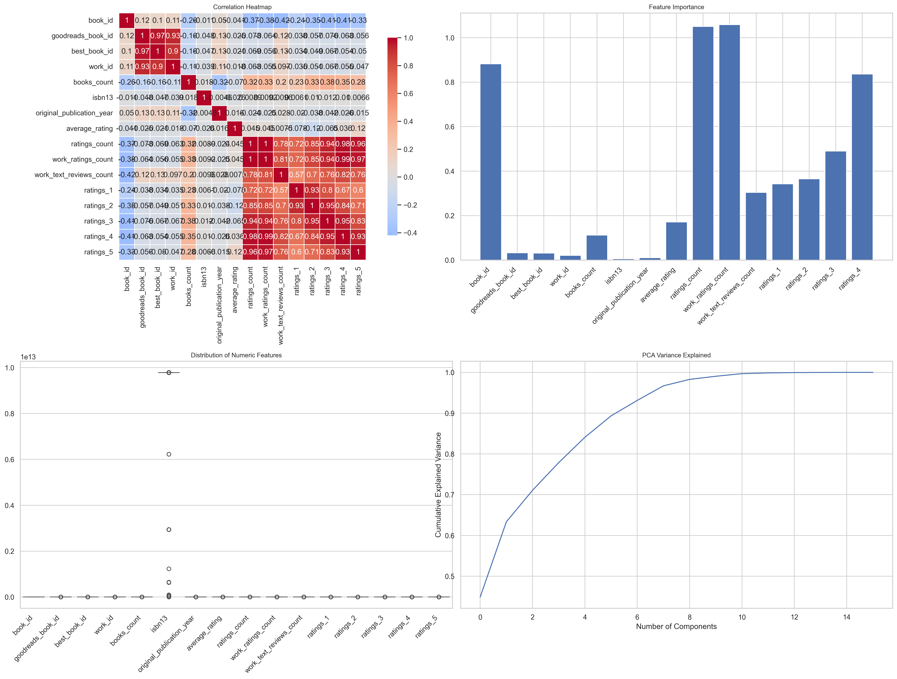

# Unearthing Literary Treasures: Insights from a Book Dataset

In a world overflowing with stories, data can serve as a helpful compass to navigate through the literary landscape. Today, we delve into an extensive dataset comprising **10,000 records** of books — a treasure trove of insights waiting to be uncovered.

## 📊 Data Description

This dataset is rich in diversity, covering **23 distinct attributes** related to books. Here’s a glimpse into some of the most notable columns:

- **book_id**: A unique identifier for each book.
- **authors**: The name or names of the authors who penned these literary works.
- **original_publication_year**: Year the book was first published, revealing trends in literary production.
- **average_rating**: The cumulative sentiment from readers, represented as an aggregate score.
- **ratings_count**: The number of votes a book has received, reflecting its popularity and reach.

### Missing Values

Though comprehensive, our dataset does have some missing values across several columns. Notably:
- **ISBN**: 700 missing entries
- **original_publication_year**: 21 missing entries
- **language_code**: 1,084 missing entries

Despite these gaps, the dataset remains a robust foundation for narrative exploration and analysis.

## 🔍 Key Insights

As we sift through the numbers, exciting patterns and insights emerge:

1. **Average Ratings Tell a Story**: The mean average rating across books is **4.00**, suggesting that many books in this collection resonate well with readers. This is a positive indicator of literary quality and engagement.

2. **Volume of Opinions**: With an impressive **ratings_count** averaging around **54,001**, it is clear that the books in this dataset are not only read but also discussed — a sign of an active reading community.

3. **Popularity and Engagement**: The top features influencing book ratings include **work_ratings_count** and **ratings_count**, giving insight into how engagement often correlates with perceived quality. Books that have been rated more frequently tend to achieve higher ratings.

4. **Literary Trends Over the Years**: The dataset shows a range in the **original_publication_year** from as early as **-1750** to **2017**, providing a broad view of literary evolution and changing reader preferences across centuries.

5. **ISBN Representation**: A significant number of books (approximately **700**) are missing ISBN numbers. Given the ISBN is essential for identification in the library and bookstore contexts, this might pose challenges for precise cataloging.

## ⚖️ Potential Implications

The insights derived from this dataset can have wide-reaching implications across various domains:

- **Publishing Industry**: Publishers can leverage this data to identify market trends, focusing on genres or authors that garner more attention and ratings, thus tailoring their acquisitions to meet reader interests.

- **Reader Engagement**: By understanding which factors (like ratings count or text reviews) influence book ratings, marketers can tailor campaigns that encourage reader engagement, encouraging them to share their thoughts.

- **Cultural Studies**: The publication year data can inspire analysis on how literature reflects or influences social movements over the centuries, providing scholars with a dataset for longitudinal studies on literary trends.

- **Recommendation Engines**: Platforms like Goodreads or Amazon can refine their recommendation algorithms, utilizing data on ratings and reviews to improve user experience and create personalized reading lists.

As we continue to explore and analyze datasets like this, we uncover more than just numbers; we reveal the stories, communities, and movements that shape our literary world. Each statistic invites us to dive deeper, fostering an eternal curiosity about the written word. 📚✨

---

## Visualizations

### Analysis Visualizations

### Pairwise Distribution

## Descriptive Statistics

| Statistic | book_id | goodreads_book_id | best_book_id | work_id | books_count | isbn13 | original_publication_year | average_rating | ratings_count | work_ratings_count | work_text_reviews_count | ratings_1 | ratings_2 | ratings_3 | ratings_4 | ratings_5 |
|---|---|---|---|---|---|---|---|---|---|---|---|---|---|---|---|---|
| count | 10000.00 | 10000.00 | 10000.00 | 10000.00 | 10000.00 | 9415.00 | 9979.00 | 10000.00 | 10000.00 | 10000.00 | 10000.00 | 10000.00 | 10000.00 | 10000.00 | 10000.00 | 10000.00 |
| mean | 5000.50 | 5264696.51 | 5471213.58 | 8646183.42 | 75.71 | 9755044298883.46 | 1981.99 | 4.00 | 54001.24 | 59687.32 | 2919.96 | 1345.04 | 3110.89 | 11475.89 | 19965.70 | 23789.81 |
| std | 2886.90 | 7575461.86 | 7827329.89 | 11751060.82 | 170.47 | 442861920665.57 | 152.58 | 0.25 | 157369.96 | 167803.79 | 6124.38 | 6635.63 | 9717.12 | 28546.45 | 51447.36 | 79768.89 |
| min | 1.00 | 1.00 | 1.00 | 87.00 | 1.00 | 195170342.00 | -1750.00 | 2.47 | 2716.00 | 5510.00 | 3.00 | 11.00 | 30.00 | 323.00 | 750.00 | 754.00 |
| 25% | 2500.75 | 46275.75 | 47911.75 | 1008841.00 | 23.00 | 9780316192995.00 | 1990.00 | 3.85 | 13568.75 | 15438.75 | 694.00 | 196.00 | 656.00 | 3112.00 | 5405.75 | 5334.00 |
| 50% | 5000.50 | 394965.50 | 425123.50 | 2719524.50 | 40.00 | 9780451528640.00 | 2004.00 | 4.02 | 21155.50 | 23832.50 | 1402.00 | 391.00 | 1163.00 | 4894.00 | 8269.50 | 8836.00 |
| 75% | 7500.25 | 9382225.25 | 9636112.50 | 14517748.25 | 67.00 | 9780830777175.00 | 2011.00 | 4.18 | 41053.50 | 45915.00 | 2744.25 | 885.00 | 2353.25 | 9287.00 | 16023.50 | 17304.50 |
| max | 10000.00 | 33288638.00 | 35534230.00 | 56399597.00 | 3455.00 | 9790007672390.00 | 2017.00 | 4.82 | 4780653.00 | 4942365.00 | 155254.00 | 456191.00 | 436802.00 | 793319.00 | 1481305.00 | 3011543.00 |

## Feature Importance

| Feature | Importance |
|---|---|
| work_ratings_count | 1.0582 |
| ratings_count | 1.0501 |
| book_id | 0.8818 |
| ratings_4 | 0.8361 |
| ratings_3 | 0.4895 |
| ratings_2 | 0.3644 |
| ratings_1 | 0.3423 |
| work_text_reviews_count | 0.3039 |
| average_rating | 0.1721 |
| books_count | 0.1102 |
| goodreads_book_id | 0.0327 |
| best_book_id | 0.0311 |
| work_id | 0.0208 |
| original_publication_year | 0.0097 |
| isbn13 | 0.0061 |

## Correlation Matrix

| Feature | book_id | goodreads_book_id | best_book_id | work_id | books_count | isbn13 | original_publication_year | average_rating | ratings_count | work_ratings_count | work_text_reviews_count | ratings_1 | ratings_2 | ratings_3 | ratings_4 | ratings_5 |
|---|---|---|---|---|---|---|---|---|---|---|---|---|---|---|---|---|
| book_id | 1.00 | 0.12 | 0.10 | 0.11 | -0.26 | -0.01 | 0.05 | -0.04 | -0.37 | -0.38 | -0.42 | -0.24 | -0.35 | -0.41 | -0.41 | -0.33 |
| goodreads_book_id | 0.12 | 1.00 | 0.97 | 0.93 | -0.16 | -0.05 | 0.13 | -0.02 | -0.07 | -0.06 | 0.12 | -0.04 | -0.06 | -0.08 | -0.06 | -0.06 |
| best_book_id | 0.10 | 0.97 | 1.00 | 0.90 | -0.16 | -0.05 | 0.13 | -0.02 | -0.07 | -0.06 | 0.13 | -0.03 | -0.05 | -0.07 | -0.05 | -0.05 |
| work_id | 0.11 | 0.93 | 0.90 | 1.00 | -0.11 | -0.04 | 0.11 | -0.02 | -0.06 | -0.05 | 0.10 | -0.03 | -0.05 | -0.07 | -0.05 | -0.05 |
| books_count | -0.26 | -0.16 | -0.16 | -0.11 | 1.00 | 0.02 | -0.32 | -0.07 | 0.32 | 0.33 | 0.20 | 0.23 | 0.33 | 0.38 | 0.35 | 0.28 |
| isbn13 | -0.01 | -0.05 | -0.05 | -0.04 | 0.02 | 1.00 | -0.00 | -0.03 | 0.01 | 0.01 | 0.01 | 0.01 | 0.01 | 0.01 | 0.01 | 0.01 |
| original_publication_year | 0.05 | 0.13 | 0.13 | 0.11 | -0.32 | -0.00 | 1.00 | 0.02 | -0.02 | -0.03 | 0.03 | -0.02 | -0.04 | -0.04 | -0.03 | -0.02 |
| average_rating | -0.04 | -0.02 | -0.02 | -0.02 | -0.07 | -0.03 | 0.02 | 1.00 | 0.04 | 0.05 | 0.01 | -0.08 | -0.12 | -0.07 | 0.04 | 0.12 |
| ratings_count | -0.37 | -0.07 | -0.07 | -0.06 | 0.32 | 0.01 | -0.02 | 0.04 | 1.00 | 1.00 | 0.78 | 0.72 | 0.85 | 0.94 | 0.98 | 0.96 |
| work_ratings_count | -0.38 | -0.06 | -0.06 | -0.05 | 0.33 | 0.01 | -0.03 | 0.05 | 1.00 | 1.00 | 0.81 | 0.72 | 0.85 | 0.94 | 0.99 | 0.97 |
| work_text_reviews_count | -0.42 | 0.12 | 0.13 | 0.10 | 0.20 | 0.01 | 0.03 | 0.01 | 0.78 | 0.81 | 1.00 | 0.57 | 0.70 | 0.76 | 0.82 | 0.76 |
| ratings_1 | -0.24 | -0.04 | -0.03 | -0.03 | 0.23 | 0.01 | -0.02 | -0.08 | 0.72 | 0.72 | 0.57 | 1.00 | 0.93 | 0.80 | 0.67 | 0.60 |
| ratings_2 | -0.35 | -0.06 | -0.05 | -0.05 | 0.33 | 0.01 | -0.04 | -0.12 | 0.85 | 0.85 | 0.70 | 0.93 | 1.00 | 0.95 | 0.84 | 0.71 |
| ratings_3 | -0.41 | -0.08 | -0.07 | -0.07 | 0.38 | 0.01 | -0.04 | -0.07 | 0.94 | 0.94 | 0.76 | 0.80 | 0.95 | 1.00 | 0.95 | 0.83 |
| ratings_4 | -0.41 | -0.06 | -0.05 | -0.05 | 0.35 | 0.01 | -0.03 | 0.04 | 0.98 | 0.99 | 0.82 | 0.67 | 0.84 | 0.95 | 1.00 | 0.93 |
| ratings_5 | -0.33 | -0.06 | -0.05 | -0.05 | 0.28 | 0.01 | -0.02 | 0.12 | 0.96 | 0.97 | 0.76 | 0.60 | 0.71 | 0.83 | 0.93 | 1.00 |
