# 🤖Automated Analysis Report

#### 📦 Column(s) Available 

`Country name`,`year`,`Life Ladder`,`Log GDP per capita`,`Social support`,`Healthy life expectancy at birth`,`Freedom to make life choices`,`Generosity`,`Perceptions of corruption`,`Positive affect`,`Negative affect` 

#### 🪫Column with missing Values 

|                                  |   0 |
|:---------------------------------|----:|
| Log GDP per capita               |  28 |
| Social support                   |  13 |
| Healthy life expectancy at birth |  63 |
| Freedom to make life choices     |  36 |
| Generosity                       |  81 |
| Perceptions of corruption        | 125 |
| Positive affect                  |  24 |
| Negative affect                  |  16 |

## 💡Story
### 🌍 Understanding the World: A Deep Dive into Happiness Metrics

In our quest to measure the world’s happiness levels, we've gathered a fascinating dataset capturing various factors across 165 countries from 2005 to 2023. The dataset explores multiple dimensions of well-being, including the Life Ladder, GDP per capita, social support, and more. Let's explore the data, its insights, and intriguing findings together! 📊✨

---

#### 📉 Summary of the Dataset

- **Key Variables**: 
   - **Country Name**: 2363 entries from 165 countries.
   - **Year**: Ranges from 2005 to 2023.
   - **Life Ladder**: A subjective measure of well-being.
   - **Log GDP per capita**: Economic indicator adjusted for inflation.
   - **Social Support**: Community engagement measurement.
   - **Healthy Life Expectancy at Birth**: Years a newborn can expect to live in good health.
   - **Freedom to Make Life Choices**: Measure of personal freedom.
   - **Generosity**: Measurement of charitable behavior.
   - **Perceptions of Corruption**: Assessment of corruption in society.
   - **Positive and Negative Affect**: Emotional metrics reflecting feelings of happiness and stress.

---

#### 📊 Descriptive Statistics

- **Life Ladder Mean**: 5.48, with a range from 1.281 to 8.019. Higher scores correlate with perceived happiness. 🌈
- **Log GDP per capita Mean**: 9.40, revealing the economic well-being of countries with the highest GDP.
- **Social Support Mean**: 0.81, indicating varying levels of community support across countries. 

---

#### 🚨 Missing Values

Identifying and addressing missing data is crucial for accurate analysis. Here are the missing counts for select fields:

| **Variable**                              | **Missing Values** |
|-------------------------------------------|---------------------|
| Log GDP per capita                        | 28                  |
| Social Support                            | 13                  |
| Healthy Life Expectancy at Birth          | 63                  |
| Freedom to Make Life Choices              | 36                  |
| Generosity                                | 81                  |
| Perceptions of Corruption                 | 125                 |
| Positive Affect                           | 24                  |
| Negative Affect                           | 16                  |

---

#### 🧮 Data Types

While the dataset primarily consists of numerical values, categorical data (like country names) plays a pivotal role. The main types include:

- **Categorical**: Country Name
- **Numerical**: Year, Life Ladder, Log GDP per capita, Social Support, Healthy Life Expectancy at Birth, Freedom to Make Life Choices, Generosity, Perceptions of Corruption, Positive Affect, Negative Affect

---

#### 📈 Correlation Insights

The correlation matrix reveals significant relationships within the data:

- **Strongest Positive Correlation**:
    - **Log GDP per capita ↔ Life Ladder (0.78)**: Wealthier nations generally report higher happiness levels.
    - **Healthy Life Expectancy ↔ Life Ladder (0.71)**: Greater health correlates with perceived well-being.
  
- **Strongest Negative Correlation**:
    - **Perceptions of Corruption ↔ Life Ladder (-0.43)**: Nations with higher corruption perceptions often have lower happiness ratings.

---

#### 🎯 Key Insights and Potential Findings

1. **Wealth and Well-Being**: Economic prosperity (Log GDP) is a significant driver of happiness, indicating policies that promote economic growth could improve life satisfaction. 💰💖
   
2. **Community and Happiness**: Social support plays a crucial role in improving Life Ladder scores, suggesting that fostering community connections can enhance overall well-being. 🌍🤝

3. **Health Matters**: A higher healthy life expectancy correlates strongly with happiness, emphasizing the importance of healthcare policies focused on longevity and well-being. 🏥🥗

4. **Corruption Impact**: Countries perceived as more corrupt tend to have a reduced happiness index, highlighting the need for transparency and ethical governance in fostering a happy society. 🔍🏛️

---

As we continue to explore the world of happiness metrics, these insights can guide policymakers and communities in creating environments conducive to well-being. Together, let’s strive for a happier and more equitable world! 🌟🌈

### 🌉Visual Analysis 2.0 
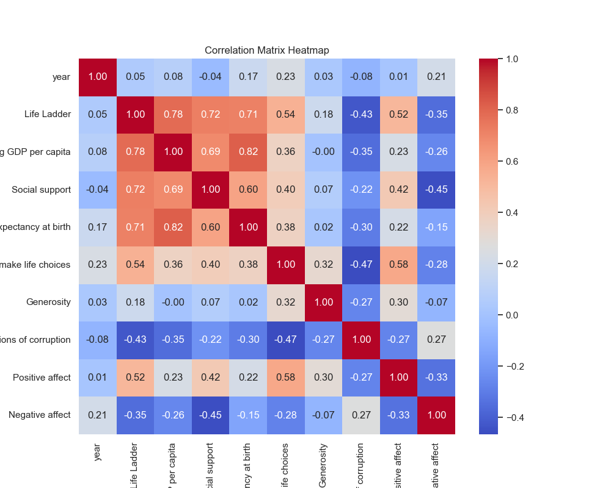
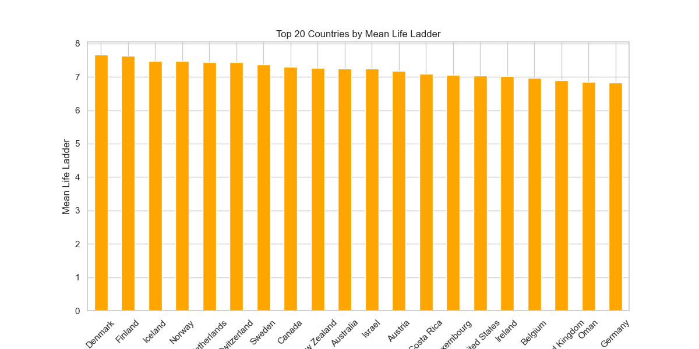
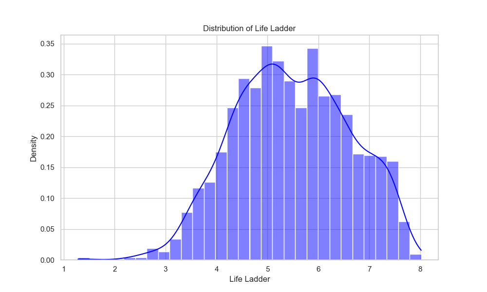
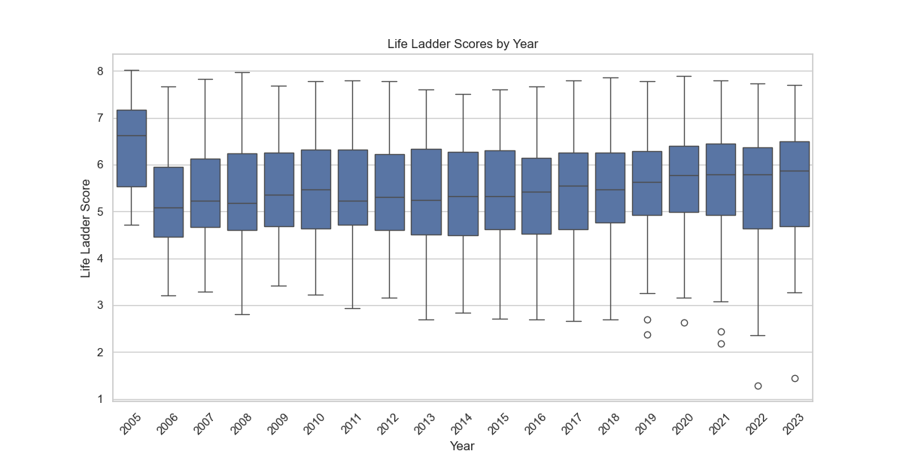
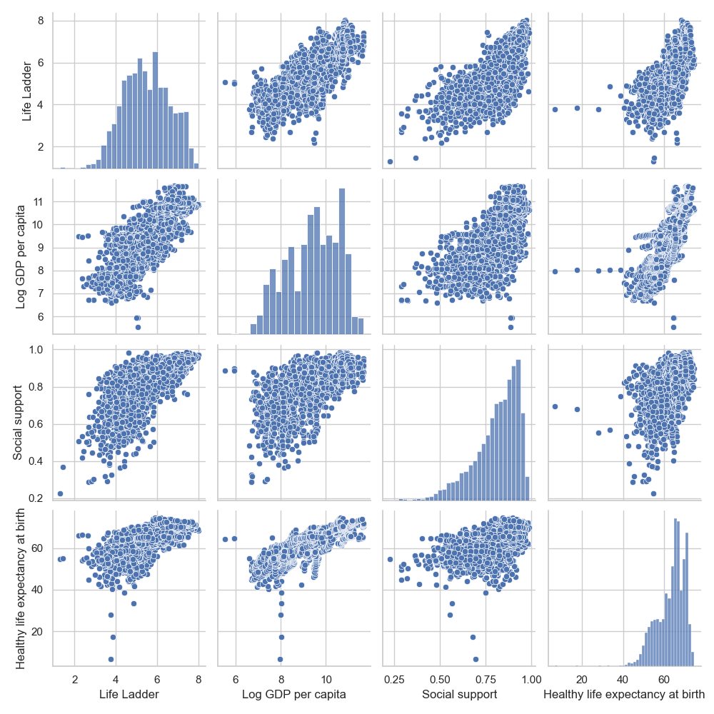

### 🌉Visualizations of Distribution 
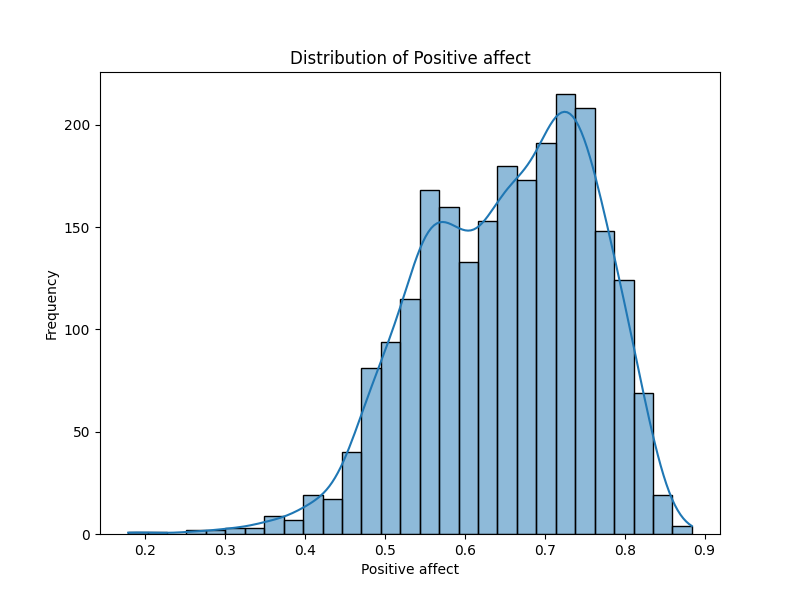
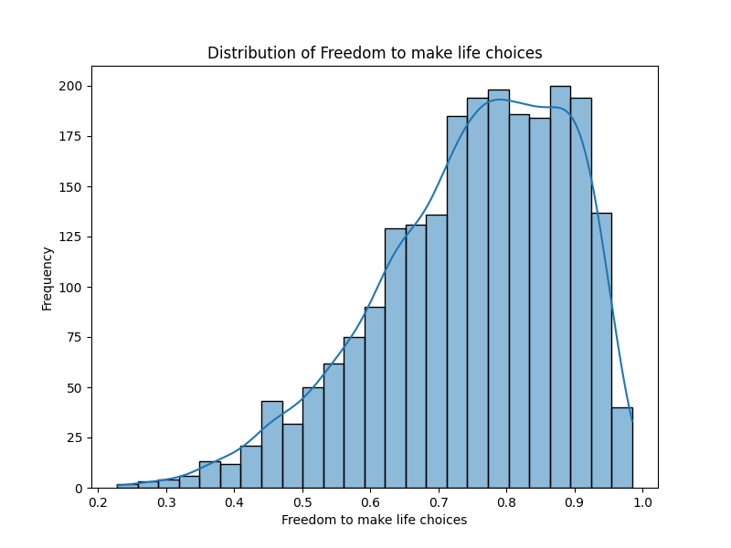
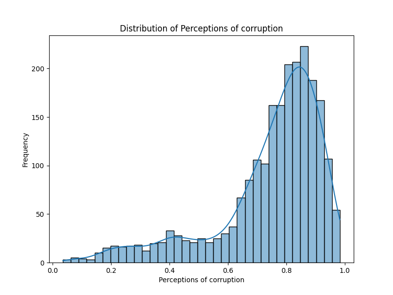
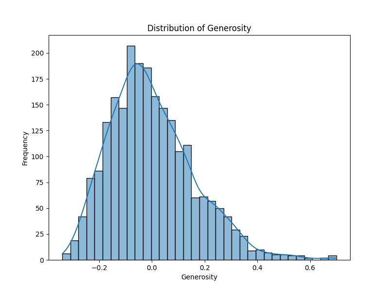
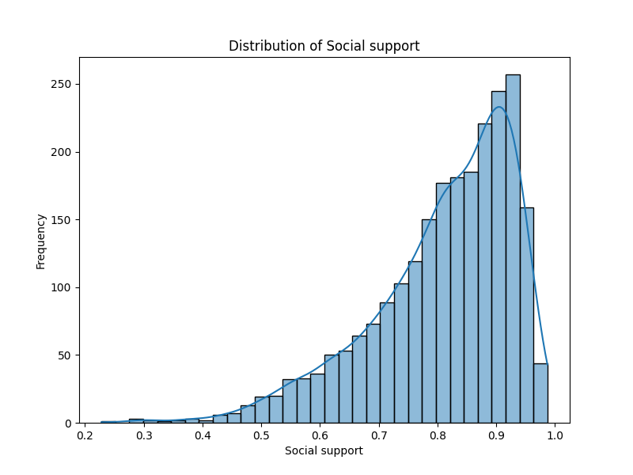
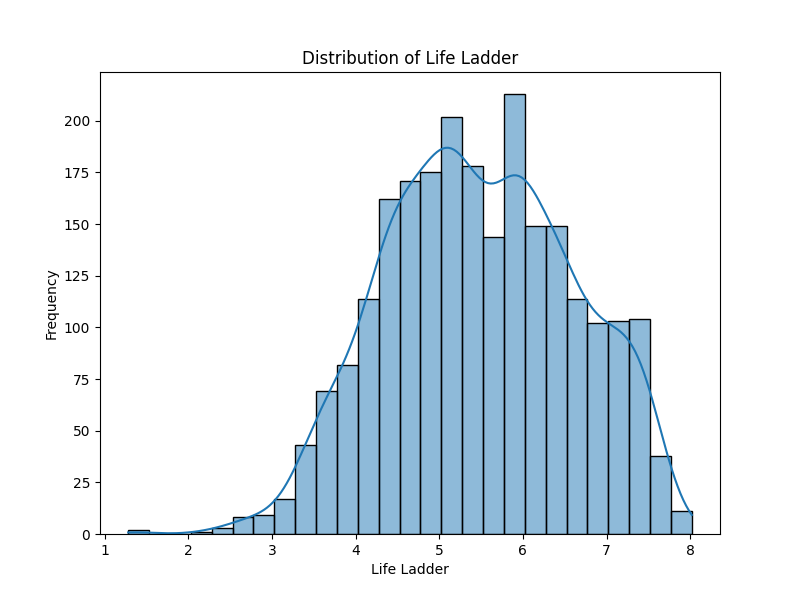
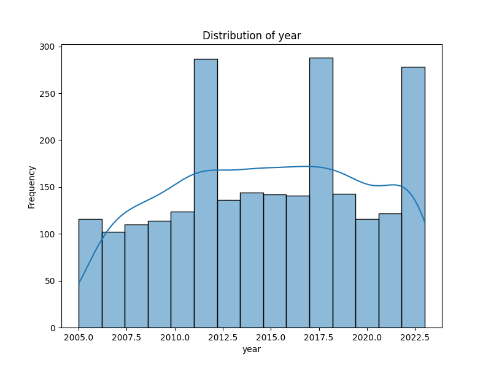
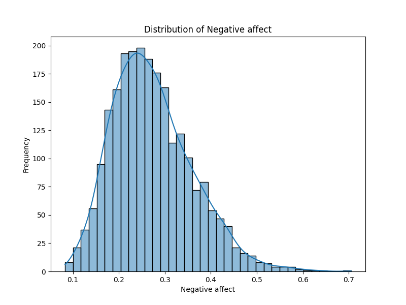
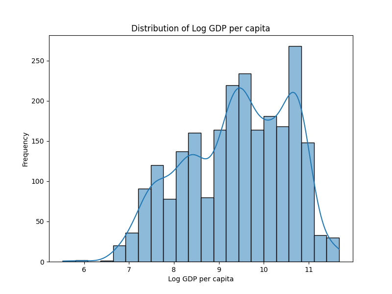
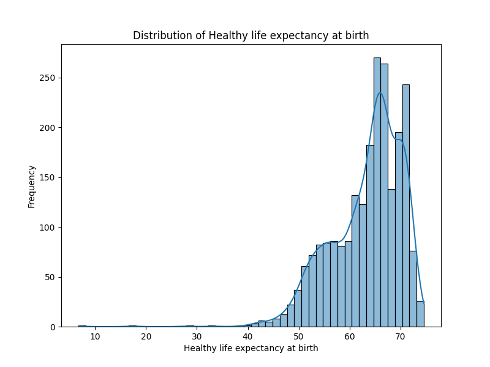
