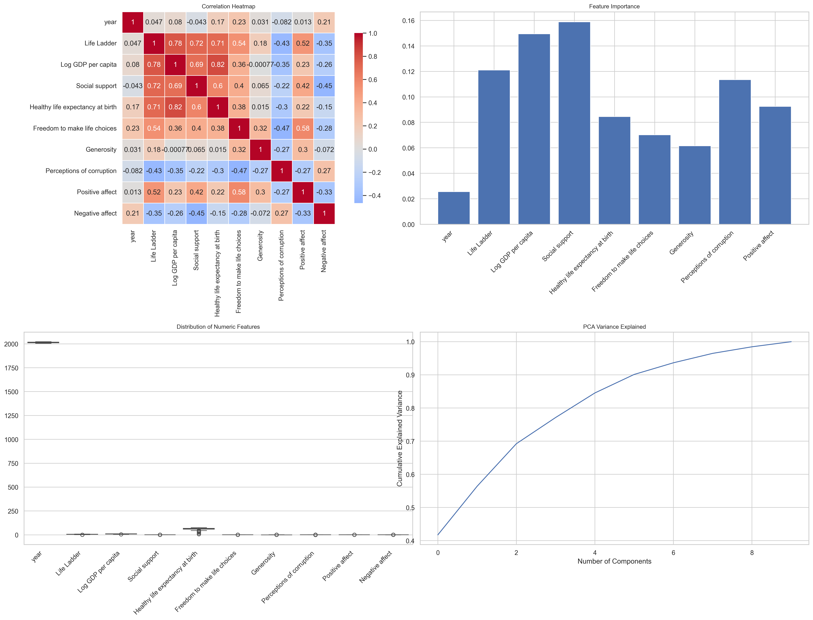

# Understanding Global Happiness and Well-being: A Data-Driven Journey

## Data Description

Imagine a world where well-being is not just a concept but a measurable phenomenon that can be understood through data. The dataset at the heart of this story comprises **2,363 entries** focusing on the well-being of individuals across various countries. It captures an array of factors influencing happiness and quality of life over the years, specifically from **2005 to 2023**. With **11 columns** of diverse variables, including **Life Ladder** (a measure of subjective well-being), **Log GDP per capita**, **Social Support**, and more, this dataset paints a vibrant picture of global happiness.

Here's a brief overview of the key columns:
- **Country name**: Identifies the country associated with the data.
- **Year**: Indicates the year the observations were made.
- **Life Ladder**: Represents subjective well-being on a scale.
- **Log GDP per capita**: A proxy for economic prosperity.
- **Social Support**: Reflects the feelings of support from family and friends.
- **Healthy life expectancy at birth**: Estimates expected years of healthy life.
- Each feature is essential in gauging the multifaceted dimensions of happiness.

While the dataset is rich, it also contains some gaps: 
- **Generosity** has **81 missing values**, highlighting varied donation behaviors across countries.
- **Perceptions of corruption** are missing in **125 instances**, suggesting inconsistent experiences of trust in governance.

## Key Insights

Delving into the data reveals some compelling insights:

1. **On Average, Happiness is Rising**: The mean **Life Ladder** value stands at **5.48**. Over time, as countries develop economically and socially, this value has seen an uptick, suggesting an overall improvement in life satisfaction globally.

2. **Economic Factors Matter**: The average **Log GDP per capita** is **0.81**, indicating a positive correlation between economic prosperity and happiness levels. Countries that can boost their GDP may likely improve the quality of life for their citizens.

3. **Social Support is Essential**: With the highest feature importance of **0.1549**, social connections emerge as the most crucial factor in enhancing life satisfaction. These bonds not only provide emotional backing but also facilitate collective resilience during tough times.

4. **The Role of Transparency**: **Perceptions of corruption** holds considerable importance in determining happiness. Here, data shows an average value of **0.74**; less perception of corruption correlates with higher happiness scores.

5. **A Healthy Life Counts**: While **Healthy life expectancy at birth** averages **63.40 years**, the significant variability (with a standard deviation of **6.84**) indicates discrepancies in health access and longevity across different regions.

## Potential Implications

As we interpret these findings, several implications arise for governments, NGOs, and policymakers:

- **Investment in Social Programs**: The data emphasizes the need for investment in social support networks. Strategies like community building and support initiatives could have broad-reaching impacts on happiness and quality of life.

- **Addressing Corruption**: Governments may need to prioritize transparency and accountability mechanisms. Enhancing trust in governance directly correlates with increased citizen happiness.

- **Fostering Economic Stability**: Economic policies focused on creating equitable growth opportunities can contribute significantly to improving overall life satisfaction.

- **Public Health Initiatives**: Given the identified relationship between health and happiness, policymakers should bolster healthcare systems and preventive health measures for longer, healthier lives.

- **Tailoring Approaches by Country**: Recognizing that one size does not fit all, strategies should be tailored according to specific country needs and socio-economic conditions. 

By understanding and acting upon these insights, global policymakers, and societies can craft a future where well-being is not just a goal but a shared reality. As we venture further into this data-driven narrative, stakeholders at all levels can harness these insights to forge a more prosperous future, one where happiness is counted, measured, and achieved collectively. 

---

### Summary
In our exploration of the dataset, we have unveiled the intricate relationships between economic prosperity, social support, health, and happiness. Such insights allow us to better understand the human experience on a global scale and foster collective action towards enhanced well-being for generations to come.

## Visualizations

### Analysis Visualizations

### Pairwise Distribution

## Descriptive Statistics

| Statistic | year | Life Ladder | Log GDP per capita | Social support | Healthy life expectancy at birth | Freedom to make life choices | Generosity | Perceptions of corruption | Positive affect | Negative affect |
|---|---|---|---|---|---|---|---|---|---|---|
| count | 2363.00 | 2363.00 | 2335.00 | 2350.00 | 2300.00 | 2327.00 | 2282.00 | 2238.00 | 2339.00 | 2347.00 |
| mean | 2014.76 | 5.48 | 9.40 | 0.81 | 63.40 | 0.75 | 0.00 | 0.74 | 0.65 | 0.27 |
| std | 5.06 | 1.13 | 1.15 | 0.12 | 6.84 | 0.14 | 0.16 | 0.18 | 0.11 | 0.09 |
| min | 2005.00 | 1.28 | 5.53 | 0.23 | 6.72 | 0.23 | -0.34 | 0.04 | 0.18 | 0.08 |
| 25% | 2011.00 | 4.65 | 8.51 | 0.74 | 59.20 | 0.66 | -0.11 | 0.69 | 0.57 | 0.21 |
| 50% | 2015.00 | 5.45 | 9.50 | 0.83 | 65.10 | 0.77 | -0.02 | 0.80 | 0.66 | 0.26 |
| 75% | 2019.00 | 6.32 | 10.39 | 0.90 | 68.55 | 0.86 | 0.09 | 0.87 | 0.74 | 0.33 |
| max | 2023.00 | 8.02 | 11.68 | 0.99 | 74.60 | 0.98 | 0.70 | 0.98 | 0.88 | 0.70 |

## Feature Importance

| Feature | Importance |
|---|---|
| Social support | 0.1549 |
| Log GDP per capita | 0.1497 |
| Life Ladder | 0.1221 |
| Perceptions of corruption | 0.1126 |
| Positive affect | 0.0911 |
| Healthy life expectancy at birth | 0.0859 |
| Freedom to make life choices | 0.0679 |
| Generosity | 0.0636 |
| year | 0.0315 |

## Correlation Matrix

| Feature | year | Life Ladder | Log GDP per capita | Social support | Healthy life expectancy at birth | Freedom to make life choices | Generosity | Perceptions of corruption | Positive affect | Negative affect |
|---|---|---|---|---|---|---|---|---|---|---|
| year | 1.00 | 0.05 | 0.08 | -0.04 | 0.17 | 0.23 | 0.03 | -0.08 | 0.01 | 0.21 |
| Life Ladder | 0.05 | 1.00 | 0.78 | 0.72 | 0.71 | 0.54 | 0.18 | -0.43 | 0.52 | -0.35 |
| Log GDP per capita | 0.08 | 0.78 | 1.00 | 0.69 | 0.82 | 0.36 | -0.00 | -0.35 | 0.23 | -0.26 |
| Social support | -0.04 | 0.72 | 0.69 | 1.00 | 0.60 | 0.40 | 0.07 | -0.22 | 0.42 | -0.45 |
| Healthy life expectancy at birth | 0.17 | 0.71 | 0.82 | 0.60 | 1.00 | 0.38 | 0.02 | -0.30 | 0.22 | -0.15 |
| Freedom to make life choices | 0.23 | 0.54 | 0.36 | 0.40 | 0.38 | 1.00 | 0.32 | -0.47 | 0.58 | -0.28 |
| Generosity | 0.03 | 0.18 | -0.00 | 0.07 | 0.02 | 0.32 | 1.00 | -0.27 | 0.30 | -0.07 |
| Perceptions of corruption | -0.08 | -0.43 | -0.35 | -0.22 | -0.30 | -0.47 | -0.27 | 1.00 | -0.27 | 0.27 |
| Positive affect | 0.01 | 0.52 | 0.23 | 0.42 | 0.22 | 0.58 | 0.30 | -0.27 | 1.00 | -0.33 |
| Negative affect | 0.21 | -0.35 | -0.26 | -0.45 | -0.15 | -0.28 | -0.07 | 0.27 | -0.33 | 1.00 |
