# 🤖Automated Analysis Report

#### 📦 Column(s) Available 

`Country name`,`year`,`Life Ladder`,`Log GDP per capita`,`Social support`,`Healthy life expectancy at birth`,`Freedom to make life choices`,`Generosity`,`Perceptions of corruption`,`Positive affect`,`Negative affect 

#### 🪫Column with missing Values 

|                                  |   0 |
|:---------------------------------|----:|
| Log GDP per capita               |  28 |
| Social support                   |  13 |
| Healthy life expectancy at birth |  63 |
| Freedom to make life choices     |  36 |
| Generosity                       |  81 |
| Perceptions of corruption        | 125 |
| Positive affect                  |  24 |
| Negative affect                  |  16 |

## 💡Story
### 🌍 Global Happiness and Economic Insights: A Data Story 📈 

In a world filled with diverse cultures and economies, the quest for happiness and well-being is a universal pursuit. Our dataset, which spans over 2363 entries from 165 countries, captures a wide range of factors that contribute to people's happiness, known as the "Life Ladder," alongside various socio-economic indicators. Let's dive into the analysis to unveil trends, correlations, and surprising insights! 💡

#### Key Metrics Overview 📊
Our dataset includes intriguing metrics such as:
- **Life Ladder**: A subjective measure of the perceived quality of life by individuals from various countries.
- **Log GDP per capita**: An indicator of economic performance adjusted for the size of the population.
- **Social Support**: Reflects the perceived support received during times of trouble.
- **Healthy Life Expectancy at Birth**: The average number of years a newborn is expected to live in good health.
- **Freedom to Make Life Choices**: The degree to which individuals feel they have the freedom to make decisions about their lives.
- **Generosity and Perceptions of Corruption**: Factors measuring altruism and the perceived honesty of the government and institutions.
- **Positive and Negative Affect**: These metrics gauge the emotional experiences of individuals, helping us understand overall well-being.

#### Summary Statistics 📈
Upon examining the summary statistics:
- The average **Life Ladder** score was around **5.48**, with a maximum score of **8.02** (representing the happiest segments of the population).
- The **Log GDP per capita** average stood at **9.40**, suggesting a strong correlation between economic wealth and self-perceived happiness.
- **Healthy life expectancy at birth** averaged about **63.40** years, highlighting the importance of health in achieving happiness.

#### Missing Values and Cleaning 🧹
Interestingly, we identified missing values across several indicators:
- **Log GDP per capita** had **28** missing entries, while **Perceptions of Corruption** had **125**. This highlights potential areas for further data collection and analysis.

#### Correlation Analysis 🔗
The correlation matrix surfaced some compelling relationships:
- **Life Ladder** has a strong positive correlation (0.78) with **Log GDP per capita**. 💰 This indicates that as GDP per capita increases, the perceived quality of life tends to improve significantly.
- **Social Support** (0.72) and **Healthy Life Expectancy** (0.71) also showed strong correlations with the Life Ladder, emphasizing that a supportive environment and good health are essential for happiness.
- A noteworthy negative correlation appeared between **Perceptions of Corruption** (-0.43) and **Life Ladder**. Countries perceiving higher corruption tend to have lower happiness scores, reminding us of the importance of trust in institutions.

#### Insights and Implications 🔍
1. **Economic Prosperity and Happiness**: Increasing GDP per capita can lead to heightened personal satisfaction. Governments might focus on economic growth as a pathway to enhance the quality of life for citizens. 🌱
2. **Support Systems Matter**: Countries with stronger social support networks can achieve better happiness outcomes. Investment in community and family support programs could have a direct impact on life satisfaction. 👫
3. **Healthcare Is Key**: As health is closely linked to happiness, prioritizing health initiatives can yield dual benefits — improving health outcomes and increasing happiness levels. 💊

#### Conclusion 🌟
The data presents a fascinating depiction of the interplay between economic factors, social support, and overall happiness across various nations. While wealth is an essential aspect, we must also focus on health, social networks, and trust in institutions to foster global well-being. Together, let us aim to create a world where every individual has the chance to aspire for a happier life! 🌈✨

---

By continuing to explore and analyze such datasets, we can unearth deeper insights and drive meaningful changes that contribute to a happier, healthier, and more equitable world. 🌏❤️

### 🌉Visual Analysis 2.0 
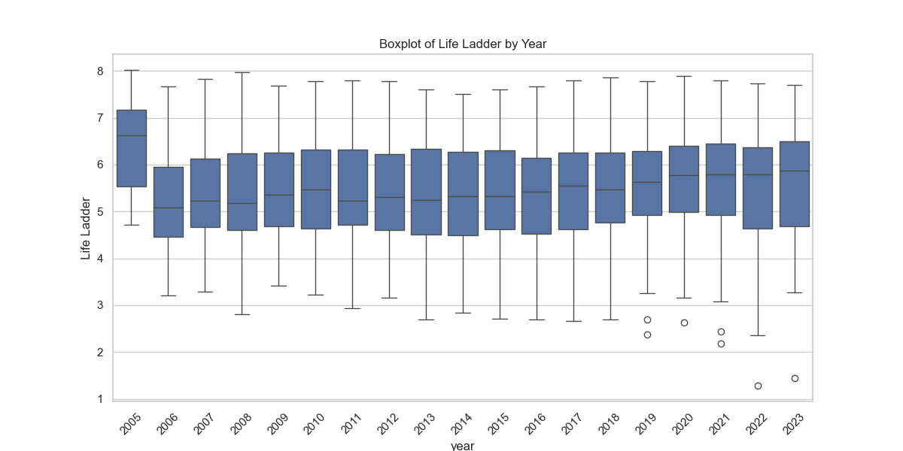
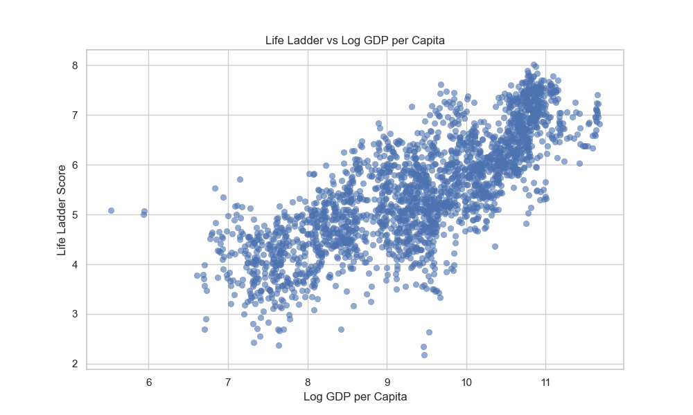
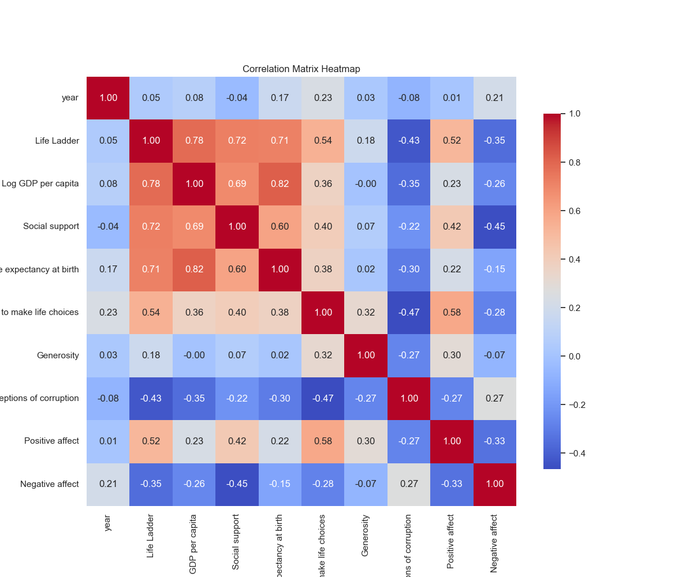

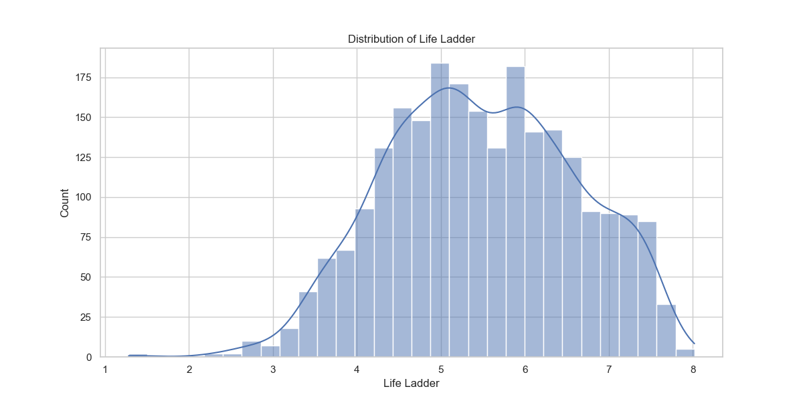
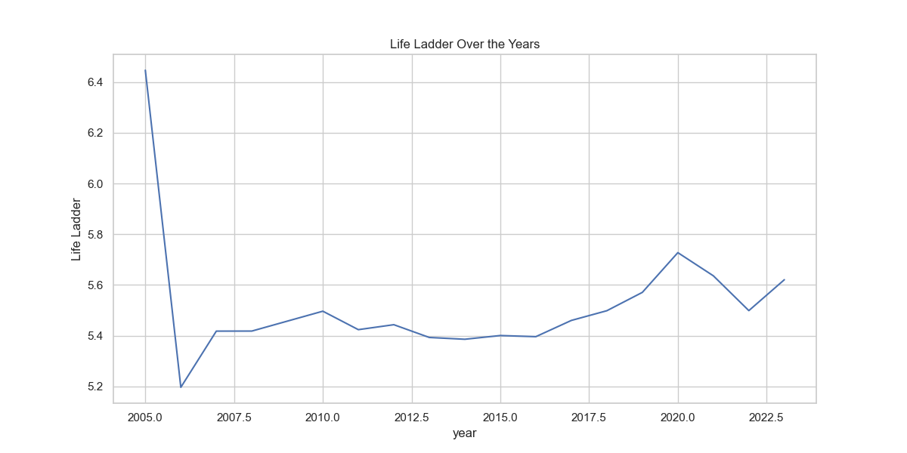
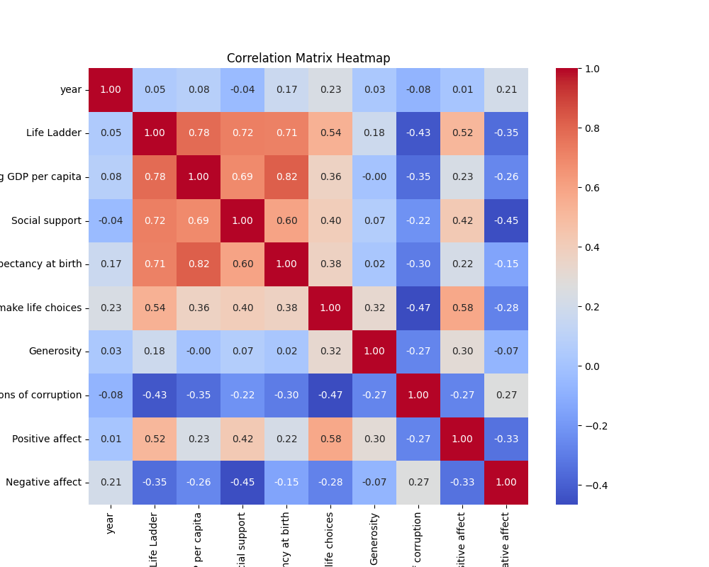

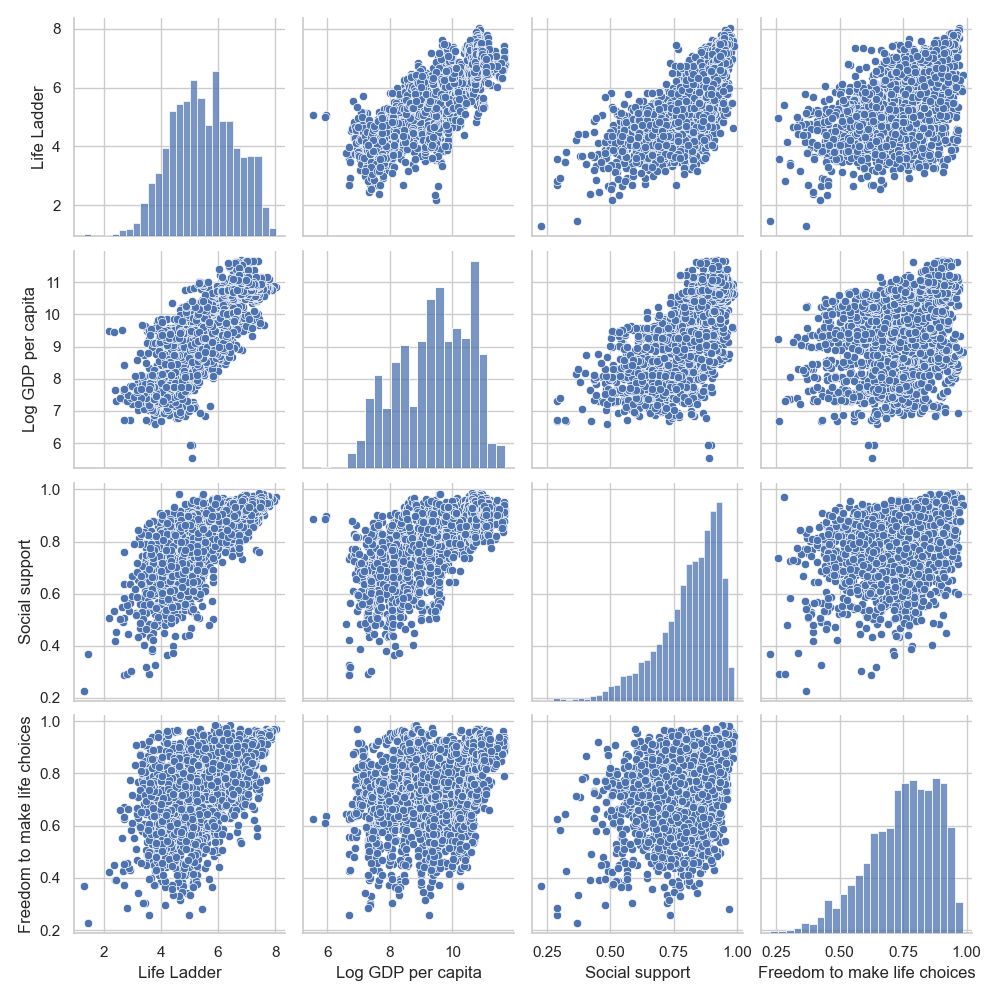
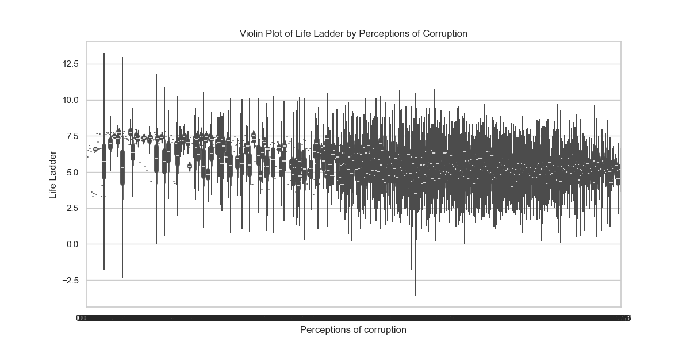

### 🌉Visualizations of Distribution 
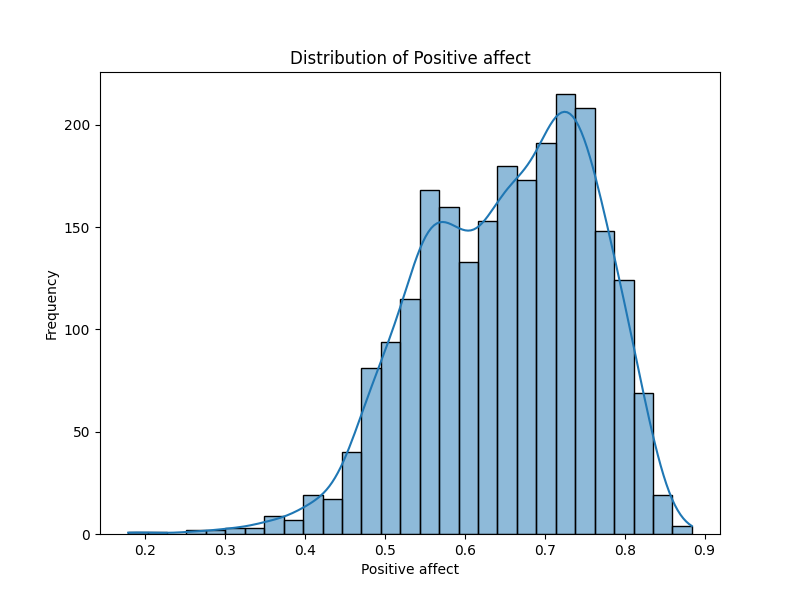
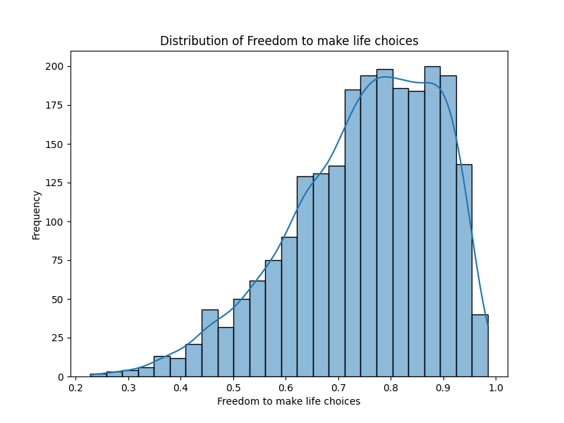
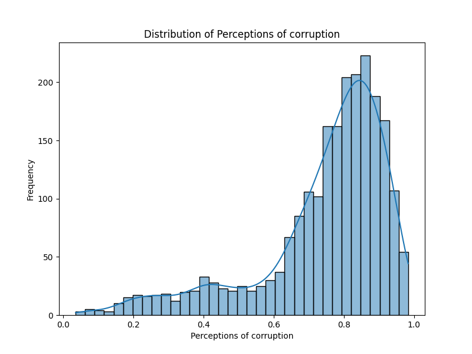

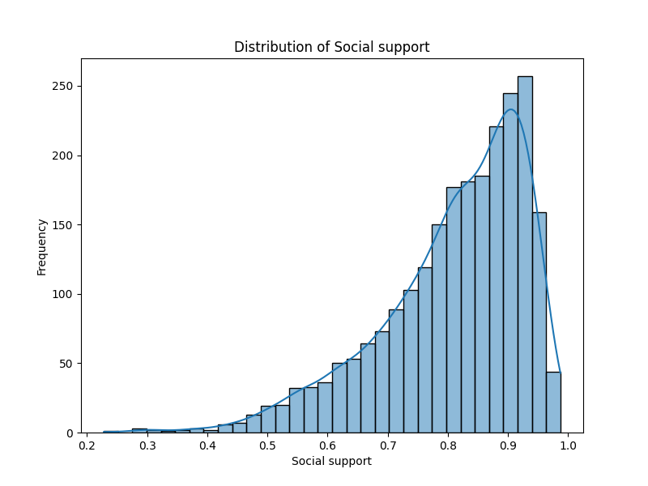
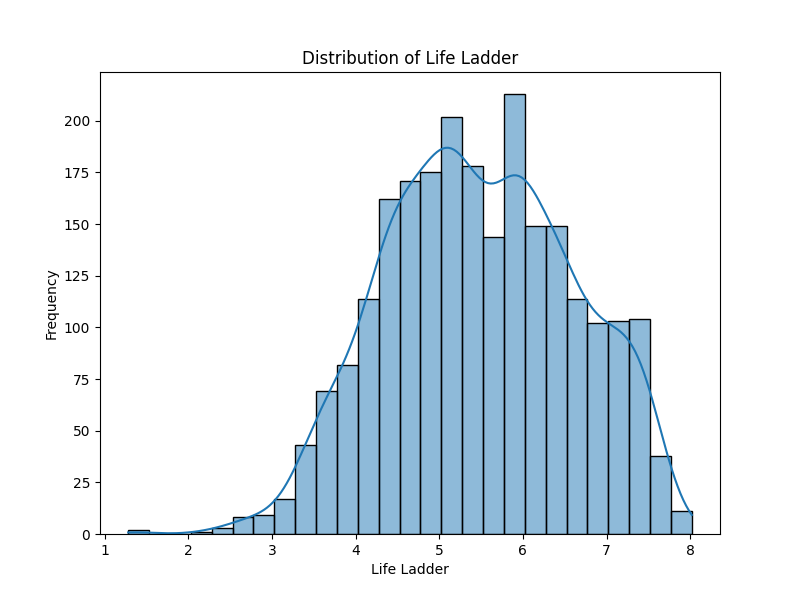

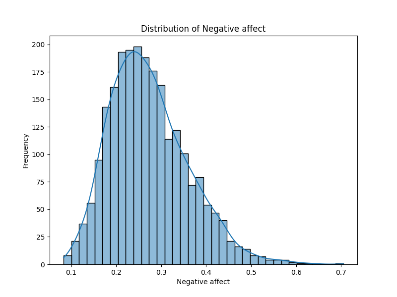
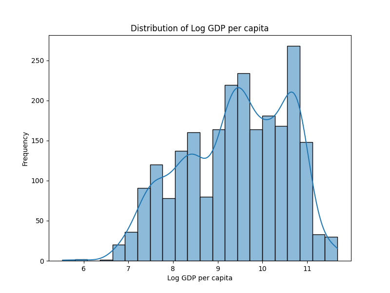
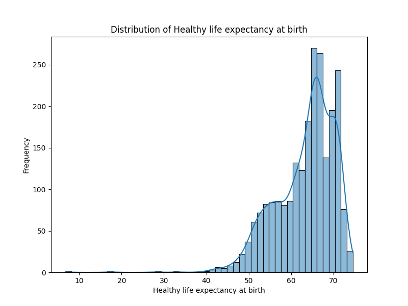
