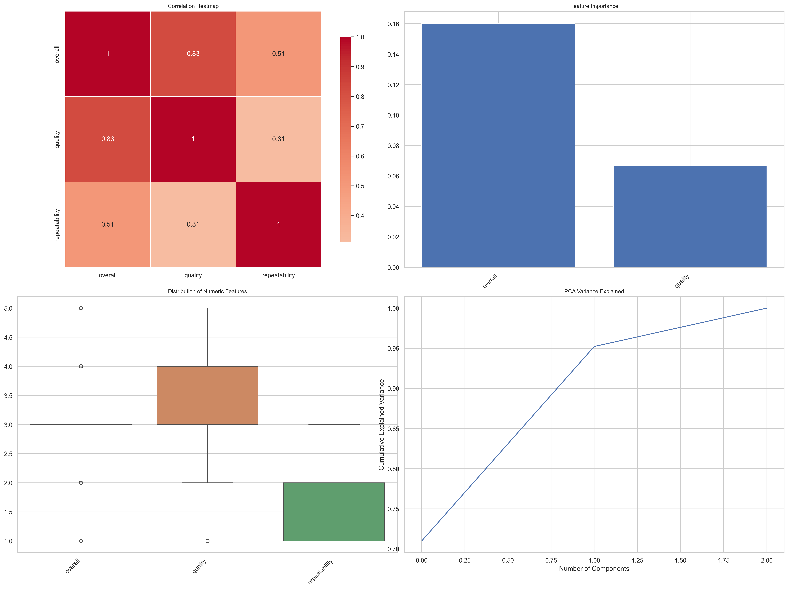
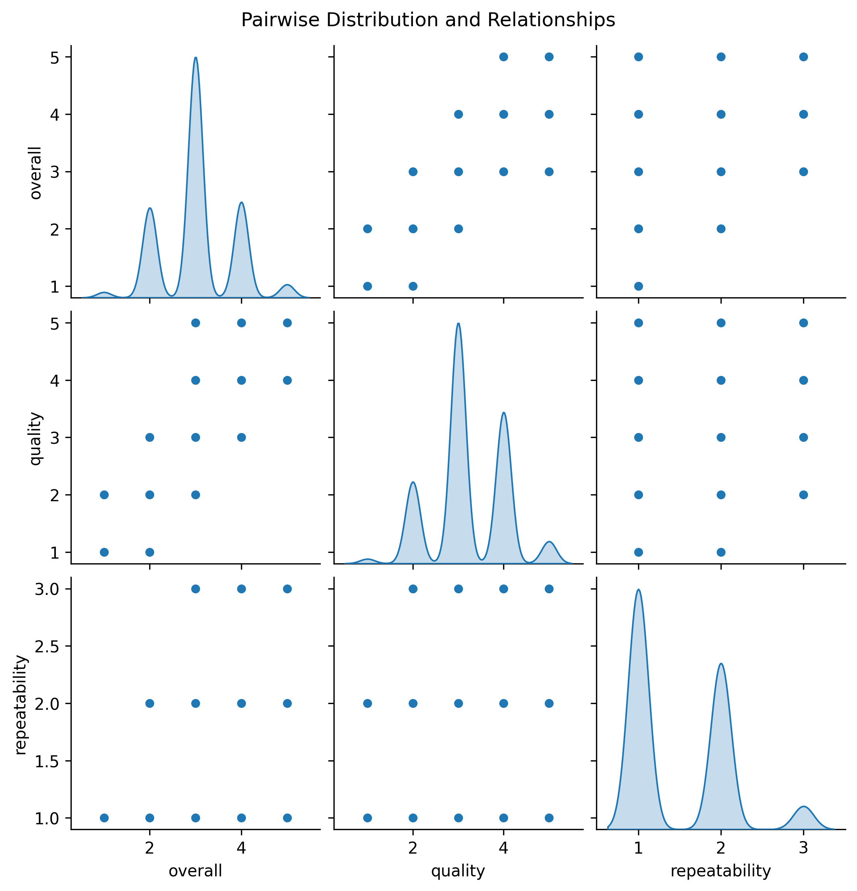

# Unveiling Insights from a Dataset on User Reviews

In our increasingly digitized world, understanding user feedback is essential for enhancing products and services. Today, we delve into a dataset that reveals a wealth of information gathered from user reviews. Let’s explore the nuances hidden within this dataset, highlighting its significance, key insights, and potential implications for future projects.

## Data Description

### Overview
The dataset comprises **2,652 rows and 8 columns**, each serving as a lens through which we can investigate user sentiment. The columns in the dataset include:
- **date** (object): The timestamp of when the review was made.
- **language** (object): The language in which the review is written.
- **type** (object): The category or type of product reviewed.
- **title** (object): The title of the review.
- **by** (object): The author of the review, with a notable count of missing entries.
- **overall** (int64): A numeric score representing the overall satisfaction, ranked from 1 to 5.
- **quality** (int64): A score indicating the quality of the item, also ranked between 1 and 5.
- **repeatability** (int64): An integer reflecting the likelihood that the user would repurchase the item, rated from 1 to 3.

### Missing Values
While the dataset is fairly complete, it is noteworthy that **99 date entries** are missing, and there are **262 missing authors**. Understanding these gaps is crucial for our analysis and future interpretation of the data.

### Descriptive Statistics
To gauge the statistical landscape of the user reviews, we break down some key metrics:

| Statistic | overall | quality | repeatability |
|-----------|---------|---------|---------------|
| count     | 2652.00 | 2652.00 | 2652.00       |
| mean      | 3.05    | 3.21    | 1.49          |
| std       | 0.76    | 0.80    | 0.60          |
| min       | 1.00    | 1.00    | 1.00          |
| 25%       | 3.00    | 3.00    | 1.00          |
| 50%       | 3.00    | 3.00    | 1.00          |
| 75%       | 3.00    | 4.00    | 2.00          |
| max       | 5.00    | 5.00    | 3.00          |

From these statistics, we learn that:
- The average **overall score** stands at **3.05**, indicating a fair level of satisfaction.
- **Quality scores** average at **3.21**, suggesting better-than-average perceptions about the products.
- With a mean **repeatability score** of **1.49**, it’s evident that many users are unsure about re-purchasing the products.

## Key Insights

1. **General Satisfaction**: The average overall score being around 3 suggests that while users are somewhat satisfied, there is significant room for improvement. 

2. **Quality Perception**: Users seem slightly more positive towards product quality compared to overall satisfaction. This implies that while products may meet basic quality expectations, they may lack features that enhance user experience.

3. **Repeatability Concerns**: A repeatability score below 2 hints at hesitance among users to repurchase, which could be a pivotal area for brands to address. Understanding why users might not be willing to repurchase could lead to actionable insights.

4. **Column Importance**: The analysis of feature importance highlights a **0.1515 correlation for overall scores** compared to a **0.0499 for quality scores**. This indicates that overall satisfaction has a stronger influence than perceived quality when it comes to the review ratings.

## Potential Implications

The insights derived from this dataset can significantly influence product development and customer engagement strategies. Here are a few actionable steps:

- **Enhanced Customer Feedback Mechanism**: Brands should leverage the feedback captured in user reviews to identify specific areas for improvement. Addressing aspects that lead to lower repeatability can foster customer loyalty.

- **Quality Improvement Initiatives**: With quality scores being relatively positive, further investment in product features or customer service could help enhance overall satisfaction, leading to higher repeat purchases.

- **Targeted Marketing Campaigns**: Understanding the demographic and behavior patterns of the missing data could facilitate targeted marketing strategies aimed at improving engagement with users who churn or do not engage as often.

In conclusion, the insights drawn from this dataset provide a foundation for brands to better understand their consumer base and refine their offerings. Effectively interpreting user-generated data can create pathways to improved satisfaction and sustained business success.

## Visualizations

### Analysis Visualizations

### Pairwise Distribution

## Descriptive Statistics

| Statistic | overall | quality | repeatability |
|---|---|---|---|
| count | 2652.00 | 2652.00 | 2652.00 |
| mean | 3.05 | 3.21 | 1.49 |
| std | 0.76 | 0.80 | 0.60 |
| min | 1.00 | 1.00 | 1.00 |
| 25% | 3.00 | 3.00 | 1.00 |
| 50% | 3.00 | 3.00 | 1.00 |
| 75% | 3.00 | 4.00 | 2.00 |
| max | 5.00 | 5.00 | 3.00 |

## Feature Importance

| Feature | Importance |
|---|---|
| overall | 0.1515 |
| quality | 0.0499 |

## Correlation Matrix

| Feature | overall | quality | repeatability |
|---|---|---|---|
| overall | 1.00 | 0.83 | 0.51 |
| quality | 0.83 | 1.00 | 0.31 |
| repeatability | 0.51 | 0.31 | 1.00 |
