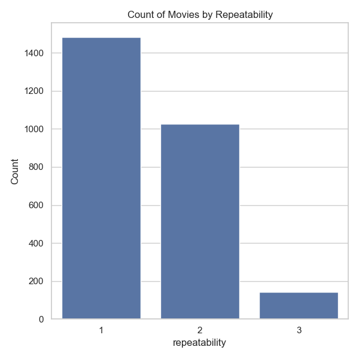
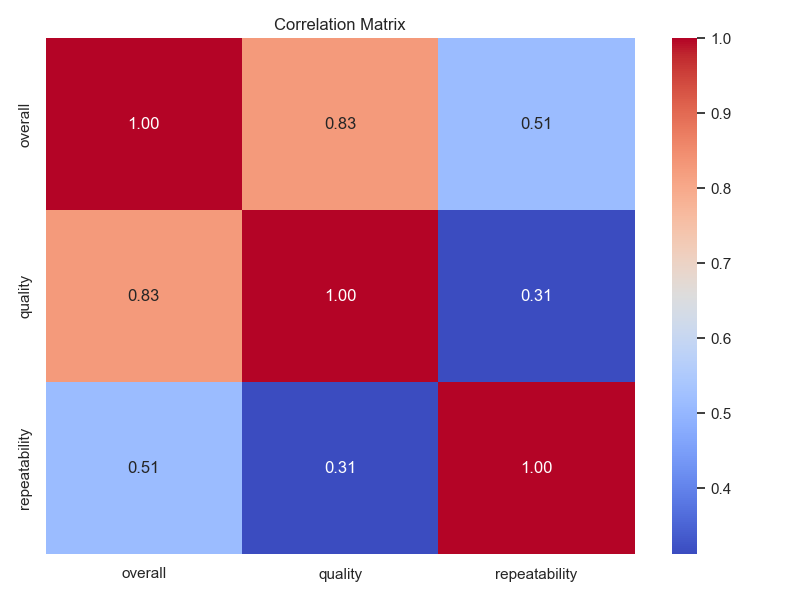
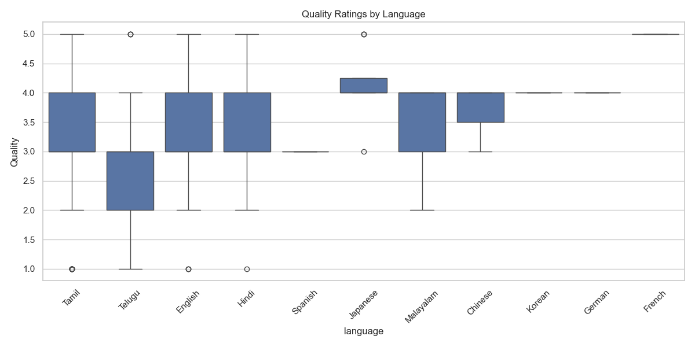
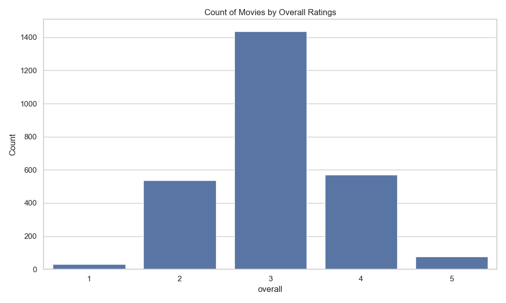
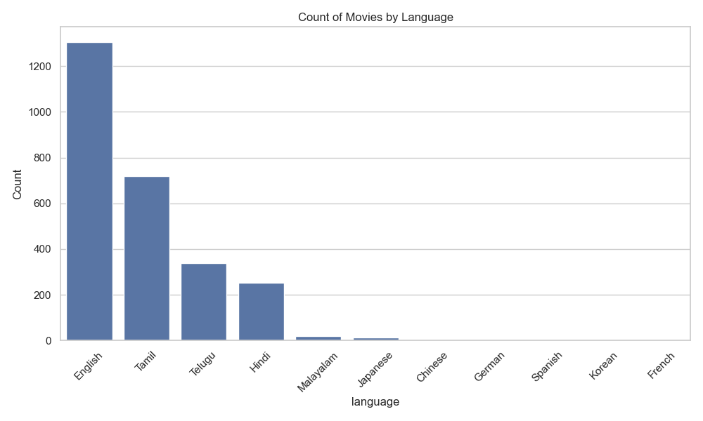
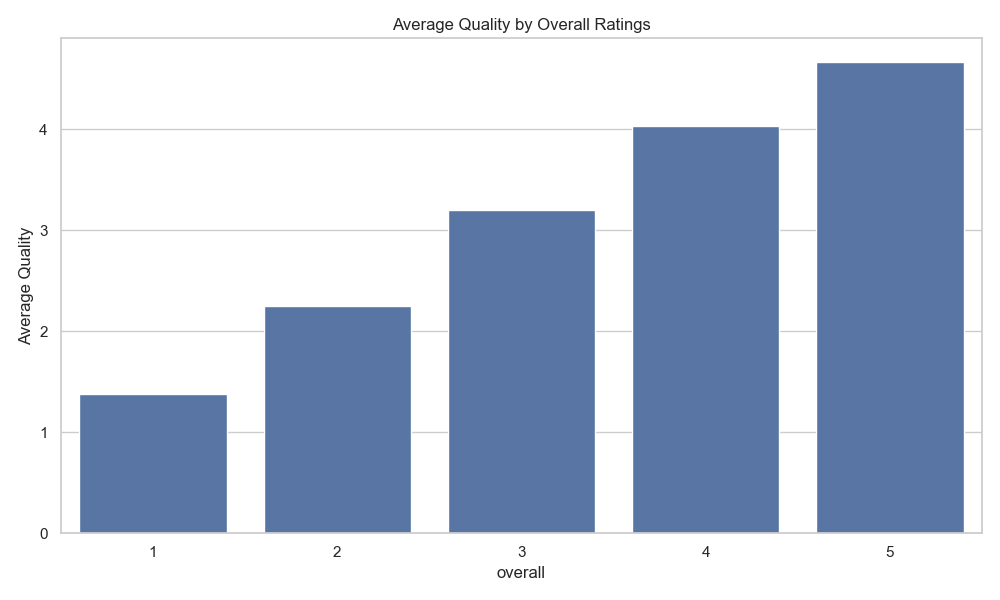
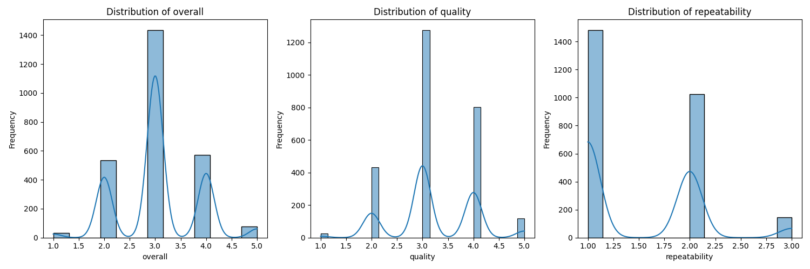

# 🤖 Automated Analysis Report

#### 📦 Column(s) Available 

`date`,`language`,`type`,`title`,`by`,`overall`,`quality`,`repeatability` 

#### 🪫 Column(s) with Missing Values 

|      |   0 |
|:-----|----:|
| date |  99 |
| by   | 262 |

## 💡 Story
### 🎬 Dive into the Dataset: A Cinematic Journey 📊

Welcome to our exploration of a fascinating movie dataset, where we dissect various films based on their release dates, languages, genres, and critical reception! Let's unravel the data and uncover some exciting insights. 🍿

---

#### 🗓️ Summary of the Dataset

Our dataset consists of **2,652 entries** that encompass a wide array of movies primarily in **English**, **Tamil**, and **Telugu**. The films are categorized into different types, all showcasing vibrant storytelling and outstanding performances.

#### 🌍 Language Breakdown

Here’s a peek at the languages represented in our dataset:

| Language      | Count |
|---------------|-------|
| English       | 1,306 |
| Tamil         | 718   |
| Telugu        | 338   |
| Hindi         | 251   |
| Malayalam     | 19    |
| Japanese      | 12    |
| Chinese       | 3     |
| German        | 2     |
| Spanish       | 1     |
| Korean        | 1     |
| French        | 1     |

**English** takes the lead with a whopping **1,306 films**, followed by **Tamil** and **Telugu**! 🎥

---

#### 📊 Summary Statistics

A glance at the average ratings reveals some intriguing trends:

| Measure        | Mean | Std. Dev. | Min | 25% | Median | 75% | Max |
|----------------|------|-----------|-----|-----|--------|-----|-----|
| Overall Rating | 3.05 | 0.76      | 1   | 3   | 3      | 3   | 5   |
| Quality Rating | 3.21 | 0.80      | 1   | 3   | 3      | 4   | 5   |
| Repeatability  | 1.49 | 0.60      | 1   | 1   | 1      | 2   | 3   |

The average overall rating stands at approximately **3.05** while quality rating is slightly higher at **3.21**. 🎭

---

#### 📈 Correlation Insights

Examining the correlation matrix unveils relationships between ratings:

| Overall | Quality | Repeatability |
|---------|---------|---------------|
| 1.000   | 0.826   | 0.513         |
| 0.826   | 1.000   | 0.312         |
| 0.513   | 0.312   | 1.000         |

There is a **strong correlation** (0.83) between overall rating and quality, suggesting that higher quality typically leads to more favorable overall ratings! 🌟

---

#### ❓ Missing Values

Understanding where data is missing is crucial for clean analyses. Here’s the rundown on the missing values:

| Column      | Missing Values |
|-------------|----------------|
| Date        | 99             |
| Language    | 0              |
| Type        | 0              |
| Title       | 0              |
| By          | 262            |
| Overall     | 0              |
| Quality     | 0              |
| Repeatability| 0              |

The **'By'** column has the most missing entries, indicating that in **262** cases, the creator or contributors are not specified. 🧐

---

#### 🎥 Final Thoughts

This dataset serves as a goldmine for movie enthusiasts and analysts alike! With insights into ratings, language popularity, and trends, we have a clearer picture of what resonates with audiences. 🎬 

Using these insights, filmmakers and marketers can strategically choose titles, collaborations, and even marketing approaches based on demographic preferences and historical successes! 

Ready for your next cinematic adventure? 🌟🍂

### 🌉 Visual Analysis 2.0 

### 🌉 Visualizations of Distribution 

