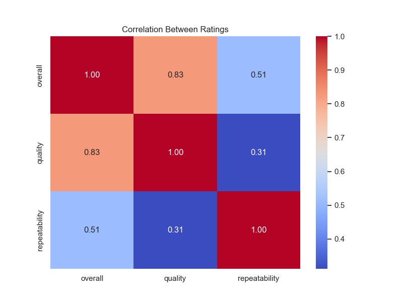
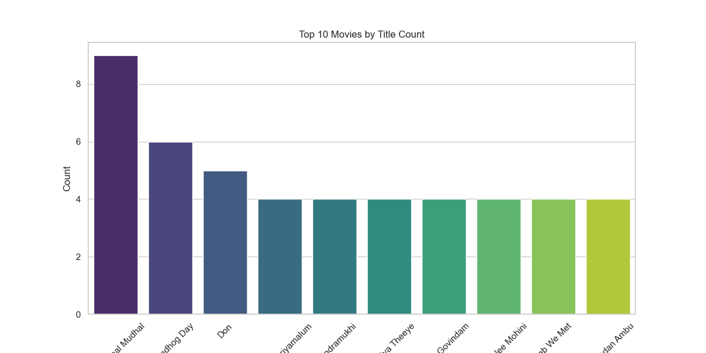
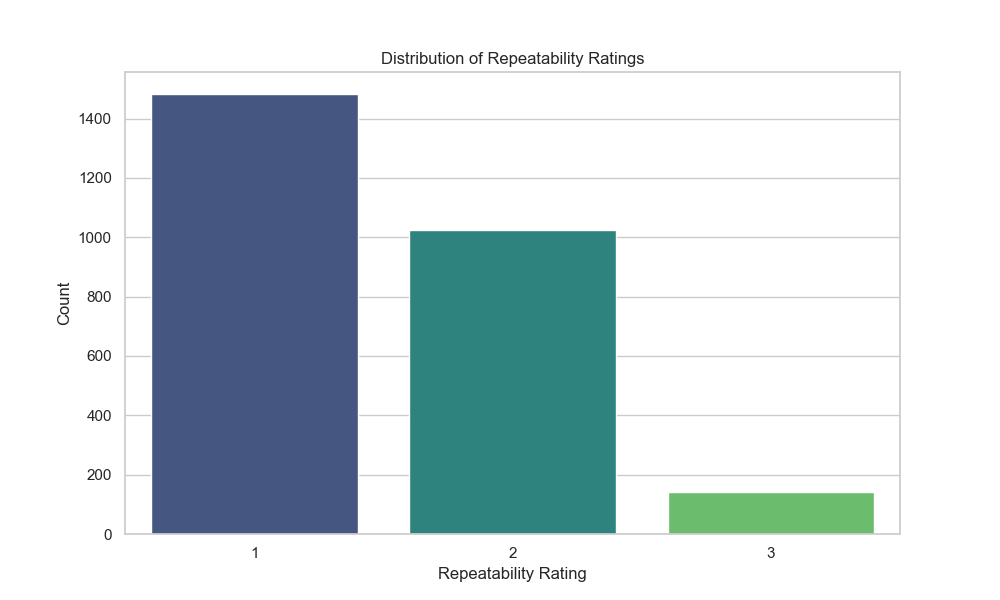
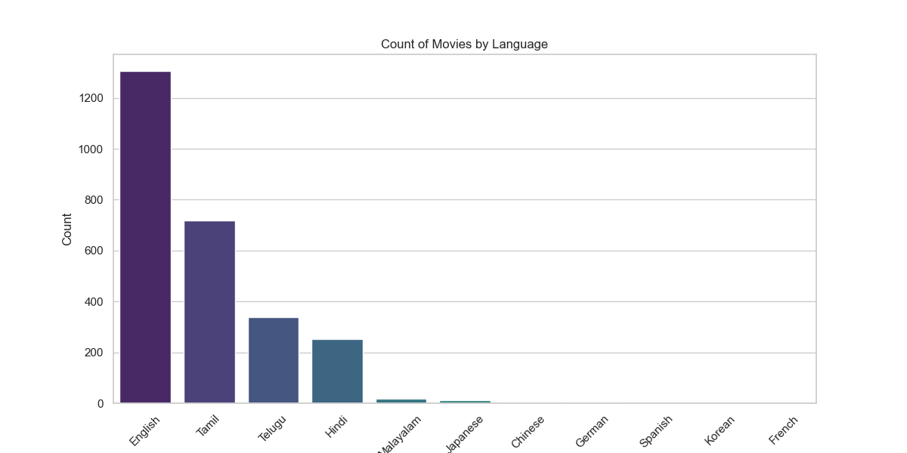
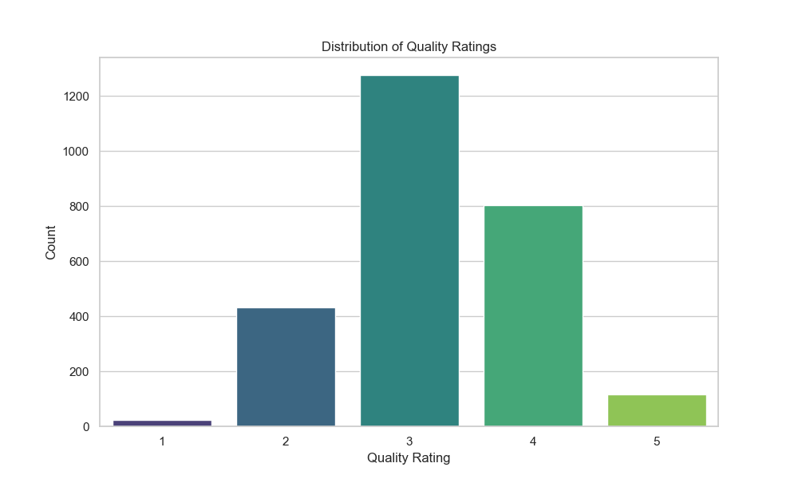
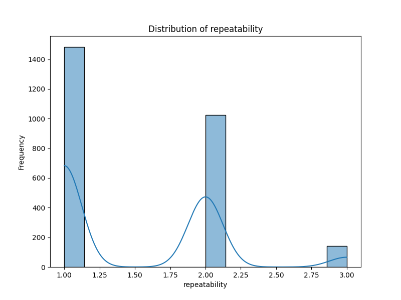
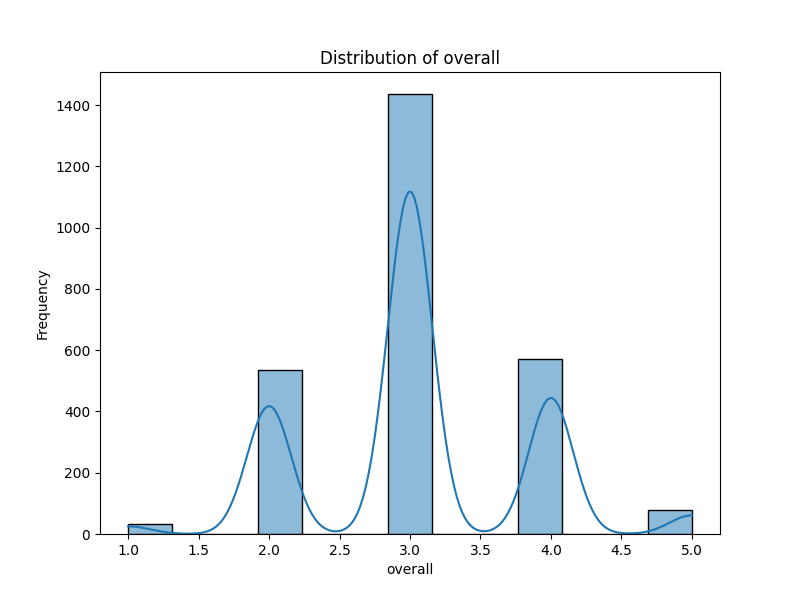
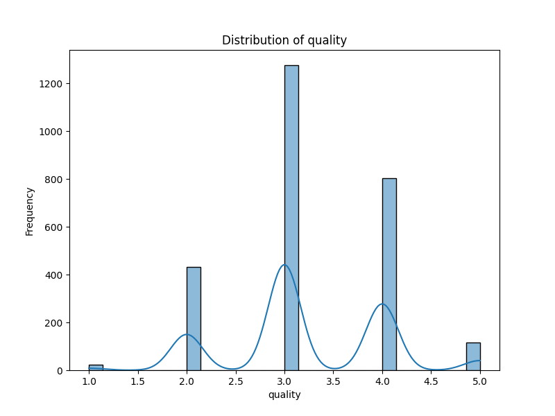

# 🤖Automated Analysis Report

#### 📦 Column(s) Available 

`date`,`language`,`type`,`title`,`by`,`overall`,`quality`,`repeatability` 

#### 🪫Column with missing Values 

|      |   0 |
|:-----|----:|
| date |  99 |
| by   | 262 |

## 💡Story
### 🎥 Movie Insights: A Statistical Journey Through Cinema 🍿

In the vast universe of films and TV series, we embarked on an analysis of a dataset consisting of 2,652 entries, perfecting our understanding of diverse cinematic experiences. Let's delve into the rich tapestry of data, revealing intriguing trends and valuable insights! 🌍✨

---

#### 🌟 Overview of the Dataset

The dataset encompasses film productions spanning different languages, types, and ratings. Here’s a snapshot:

| **Feature**         | **Count** | **Unique Values** | **Top Value**            | **Frequency** | **Mean**      | **Std Dev**   | **Min** | **Max** |
|---------------------|-----------|--------------------|--------------------------|---------------|---------------|----------------|---------|---------|
| **Date**            | 2,553     | 2055               | 21-May-06                | 8             | N/A           | N/A            | N/A     | N/A     |
| **Language**        | 2,652     | 11                 | English                   | 1,306         | N/A           | N/A            | N/A     | N/A     |
| **Type**            | 2,652     | 8                  | Movie                     | 2,211         | N/A           | N/A            | N/A     | N/A     |
| **Title**           | 2,652     | 2,312              | Kanda Naal Mudhal        | 9             | N/A           | N/A            | N/A     | N/A     |
| **Directed By**     | 2,390     | 1,528              | Kiefer Sutherland         | 48            | N/A           | N/A            | N/A     | N/A     |
| **Overall Rating**  | 2,652     | N/A                | N/A                       | N/A           | 3.05          | 0.76           | 1       | 5       |
| **Quality Rating**  | 2,652     | N/A                | N/A                       | N/A           | 3.21          | 0.80           | 1       | 5       |
| **Repeatability**   | 2,652     | N/A                | N/A                       | N/A           | 1.49          | 0.60           | 1       | 3       |

---

#### 📊 Data Quality & Missing Values

Before diving into analysis, we identified some missing pieces in our cinematic puzzle:

| **Feature**        | **Missing Values** |
|--------------------|---------------------|
| **Date**           | 99                  |
| **Language**       | 0                   |
| **Type**           | 0                   |
| **Title**          | 0                   |
| **Directed By**    | 262                 |
| **Overall Rating** | 0                   |
| **Quality Rating** | 0                   |
| **Repeatability**  | 0                   |

Missing values predominantly appeared in the *Date* and *Directed By* columns. 📅🗂️

---

#### 🔍 Analysis of Ratings

The distribution of ratings helps us understand the viewer sentiments:

- **Overall Ratings**: The average rating is approximately 3.05, indicating that most films maintain a satisfactory to good status.
- **Quality Ratings**: An average of 3.21 suggests a slight inclination towards higher quality production values.
- **Repeatability**: With a mean value of 1.49, viewers generally regard these films as enjoyable yet not necessarily worth repeating.

---

#### 🤝 Correlation Observations

Exploring relationships between different numerical ratings revealed interesting correlations:

| **Feature**        | **Overall** | **Quality** | **Repeatability** |
|--------------------|-------------|-------------|--------------------|
| **Overall**        | 1.000       | 0.826       | 0.513              |
| **Quality**        | 0.826       | 1.000       | 0.312              |
| **Repeatability**   | 0.513       | 0.312       | 1.000              |

The above correlation matrix illustrates that the quality ratings significantly influence overall ratings (0.83 correlation). This indicates that on average, films with higher quality ratings tend to receive better overall assessments from viewers. 📈

---

#### 🌍 Language and Genre Distribution

The dataset predominantly features content in **English** (1,306 entries), followed by **Tamil** (718) and **Telugu** (338). Most of these entries are categorized as *movies* (2,211), revealing a strong penchant for feature films over other types like TV series or shorts. 🎬

### 🌉Visual Analysis 2.0 

### 🌉Visualizations of Distribution 

