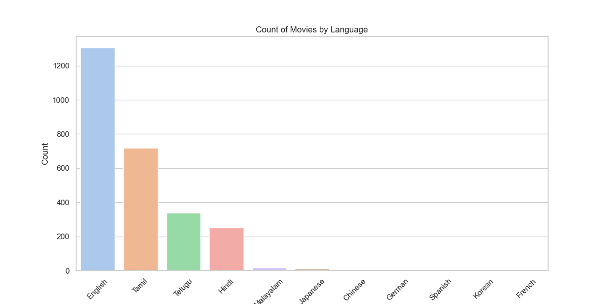
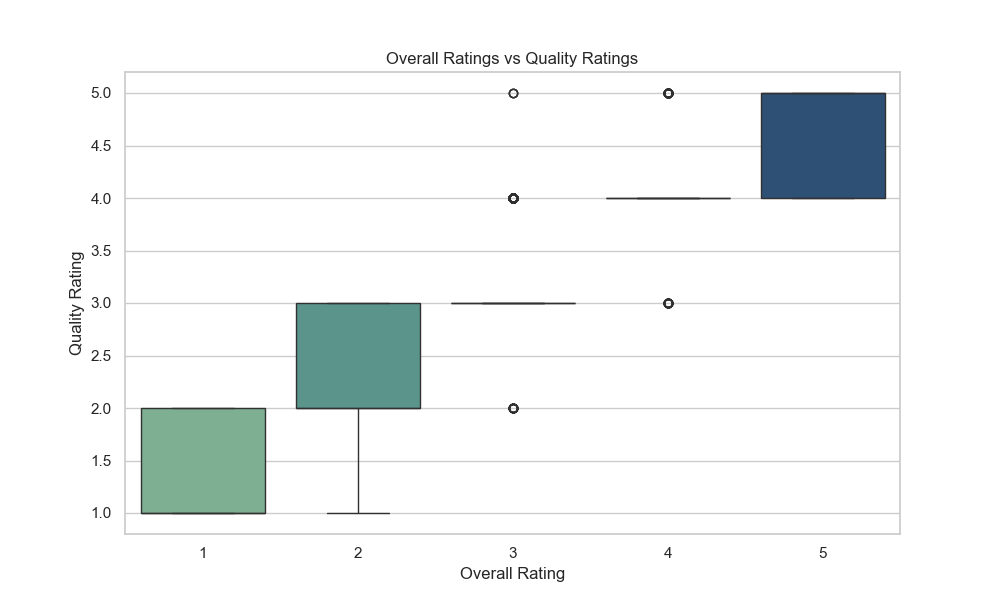
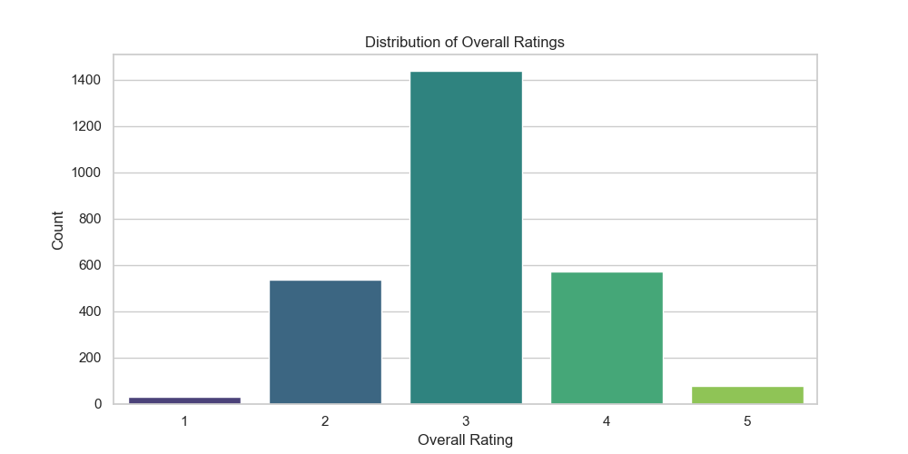
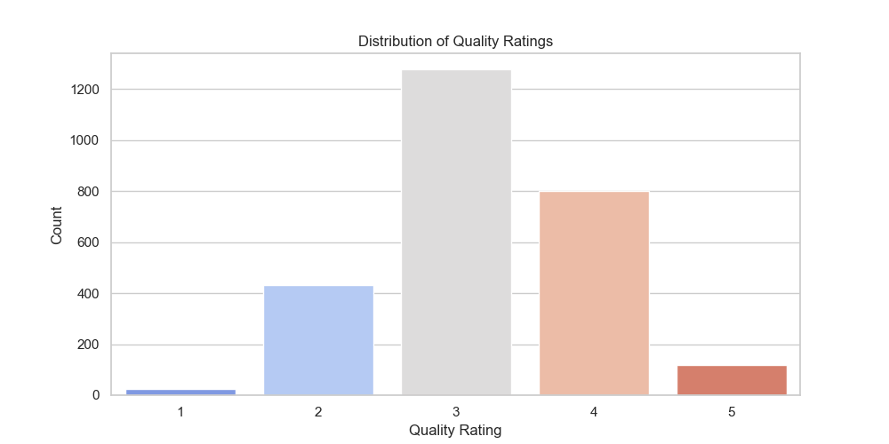

# 🤖Automated Analysis Report

#### 📦 Column(s) Available 

`date`,`language`,`type`,`title`,`by`,`overall`,`quality`,`repeatability 

#### 🪫Column with missing Values 

|      |   0 |
|:-----|----:|
| date |  99 |
| by   | 262 |

## 💡Story
### 🎥 Movie Dataset Insights 📊

In the fascinating world of cinema, our dataset showcases a vibrant selection of movies and series spanning multiple languages, directors, and genres. Let's dive into the data and unveil some insightful statistics and trends! 🌟

#### 📅 Time Trends:
The dataset spans a total of **2,553** unique dates, with the earliest entry dating back to **21-May-06** and the most recent entry being **15-Nov-24**. Notably, **21-May-06** holds the record for the highest frequency of occurrences at **8** entries. 

#### 🌍 Language Diversity:
The dataset comprises a diverse palette of **11 languages**, with the following counts:

| **Language** | **Count** |
|--------------|-----------|
| English      | 1,306     |
| Tamil        | 718       |
| Telugu       | 338       |
| Hindi        | 251       |
| Malayalam    | 19        |
| Japanese     | 12        |
| Chinese      | 3         |
| German       | 2         |
| Spanish      | 1         |
| Korean       | 1         |
| French       | 1         |

📈 **Insight**: _English dominates the dataset, followed by Tamil and Telugu. This indicates a diverse cinematic reach, appealing to multiple audiences._

#### 🎬 Type of Content:
The content is primarily categorized as **movies**, with **2,211** entries, while **196** belong to fiction, **112** to TV series, and so forth:

| **Type**       | **Count** |
|----------------|-----------|
| Movie          | 2,211     |
| Fiction        | 196       |
| TV Series      | 112       |
| Non-Fiction    | 60        |
| Video          | 42        |
| Series         | 19        |
| Script         | 8         |
| Short          | 4         |

#### 🌟 Title Popularity:
There are **2,312 unique titles** in the dataset, with the following title being the most frequently recorded:

- **Kanda Naal Mudhal**: 9 occurrences 🎉

#### 🙌 Credits:
The dataset features **1,528 unique creators**, with **Kiefer Sutherland** leading at **48** mentions. Here’s the breakdown:

| **Creator**                        | **Count** |
|------------------------------------|-----------|
| Kiefer Sutherland                   | 48        |
| Dean Cain, Teri Hatcher            | 21        |
| Jeffrey Archer                      | 18        |
| Brandon Sanderson                  | 18        |
| Bruce Willis                       | 12        |

#### ⭐ Ratings Overview:
Analyzing the ratings offered by viewers, we find an average **overall score** of **3.05**, with the scores distributed as follows:

| **Overall Rating** | **Count** |
|--------------------|-----------|
| 1                  | 32        |
| 2                  | 536       |
| 3                  | 1,436     |
| 4                  | 570       |
| 5                  | 78        |

#### 📉 Quality Ratings:
The **quality** rating reflects a similar trend with an average score of **3.21**:

| **Quality Rating** | **Count** |
|--------------------|-----------|
| 1                  | 24        |
| 2                  | 433       |
| 3                  | 1,276     |
| 4                  | 802       |
| 5                  | 117        |

#### 🔄 Repeatability:
The **repeatability** scores indicate viewer engagement:

| **Repeatability Rating** | **Count** |
|--------------------------|-----------|
| 1                        | 1,483     |
| 2                        | 1,026     |
| 3                        | 143       |

#### 📊 Correlation Matrix:
The correlation between overall scores, quality, and repeatability hints at a more intricate relationship with viewers’ experiences:

| **Metrics**         | **Overall** | **Quality** | **Repeatability** |
|---------------------|-------------|-------------|-------------------|
| Overall             | 1.000       | 0.826       | 0.513             |
| Quality             | 0.826       | 1.000       | 0.312             |
| Repeatability       | 0.513       | 0.312       | 1.000             |

#### 🚫 Missing Values:
To note a couple of missing aspects, the dataset includes missing values as follows:

| **Field**      | **Missing Count** |
|----------------|--------------------|
| Date           | 99                 |
| Language       | 0                  |
| Type           | 0                  |
| Title          | 0                 

### 🌉Visual Analysis 2.0 

### 🌉Visualizations of Distribution 

