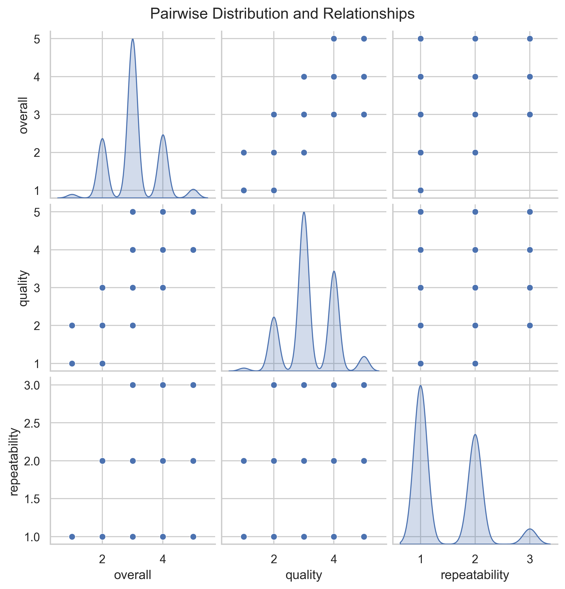

# Exploring a Dataset of Reviews: Unpacking Insights and Implications

In today's data-driven world, the ability to glean insightful narratives from datasets has never been more vital. Join me as we explore a fascinating dataset that comprises reviews, shedding light on factors like overall ratings, quality, and repeatability.

## Data Description

Our dataset consists of **2,652 rows** and **8 columns** that offer a glimpse into various aspects of reviews. Each entry represents a unique review, containing crucial descriptive information. Below is a quick recap of the columns:

- **date**: Date of the review (some missing values).
- **language**: Language in which the review was written (no missing values).
- **type**: Type of the review (no missing values).
- **title**: Title of the review (no missing values).
- **by**: Author of the review (some missing values).
- **overall**: Overall rating given in the review (scale: 1-5).
- **quality**: Rating reflecting the quality of the item or service reviewed (scale: 1-5).
- **repeatability**: Rating reflecting the likelihood of recommending the item or service (scale: 1-3).

While most columns are well populated, we do encounter some missing values — notably, 99 entries for "date" and 262 entries for the "by" column. 

### Missing Values Summary

| Column         | Missing Values |
|----------------|-----------------|
| date           | 99              |
| by             | 262             |
| language       | 0               |
| type           | 0               |
| title          | 0               |
| overall        | 0               |
| quality        | 0               |
| repeatability  | 0               |

## Key Insights

Looking at the descriptive statistics, we discover a lot about the nature of the reviews:

- **Overall Ratings**: The average overall rating is **3.05**, suggesting that the reviews tend to be slightly above average, with a minimum rating of **1** and a maximum of **5**.
- **Quality Ratings**: With a mean rating of **3.21**, the quality perception among reviewers is also marginally positive.
- **Repeatability Ratings**: This metric appears to be more limited in scope (1-3 scale) with a mean of **1.49**, indicating that the likelihood of recommending the product or service might be less favorable.

### Descriptive Statistics Overview

| Statistic | overall | quality | repeatability |
|-----------|---------|---------|---------------|
| count     | 2652.00 | 2652.00 | 2652.00       |
| mean      | 3.05    | 3.21    | 1.49          |
| std       | 0.76    | 0.80    | 0.60          |
| min       | 1.00    | 1.00    | 1.00          |
| 25%       | 3.00    | 3.00    | 1.00          |
| 50%       | 3.00    | 3.00    | 1.00          |
| 75%       | 3.00    | 4.00    | 2.00          |
| max       | 5.00    | 5.00    | 3.00          |

## Feature Importance

In order to understand which factors might be influencing review outcomes — particularly overall ratings — we measure feature importance. Here’s a quick look:

| Feature   | Importance   |
|-----------|--------------|
| overall   | 0.1452       |
| quality   | 0.0430       |

The entire ratio indicates that the overall rating itself has a relatively higher weight, which can be crucial for future tests of both quality and repeatability. 

## Potential Implications

These insights carry a wealth of implications. Firstly, the data suggest that while users generally rate products or services positively, there's a notable lack of enthusiasm regarding repeat recommendations. This could prompt businesses to investigate underlying issues:

- **Improving Quality**: With quality ratings hovering around the average, enhancement initiatives could be implemented to address customer concerns, leading to improved repeatability ratings.
- **Fostering Stronger Relationships**: The high percentage of missing reviewers signals an opportunity for brands to foster better engagements, encouraging customers to come forward, thereby increasing the customer base.
- **Temporal Analysis**: The missing dates could deter temporal analyses that might have revealed trends over time. Collecting complete chronological data in future endeavors will assist in tracking long-term customer sentiments.

## Final Thoughts

This dataset offers a wealth of understanding on how consumers perceive and rate various products or services. Future investigations can expand on these insights, helping marketers tailor strategies to improve quality, enhance customer loyalty, and ultimately amplify the overall consumer experience. Data storytelling doesn't just tell us what's happening; it opens the door to understanding how we can make informed choices in the world of consumers and businesses!

## Visualizations

### Analysis Visualizations

### Pairwise Distribution

## Descriptive Statistics

| Statistic | overall | quality | repeatability |
|---|---|---|---|
| count | 2652.00 | 2652.00 | 2652.00 |
| mean | 3.05 | 3.21 | 1.49 |
| std | 0.76 | 0.80 | 0.60 |
| min | 1.00 | 1.00 | 1.00 |
| 25% | 3.00 | 3.00 | 1.00 |
| 50% | 3.00 | 3.00 | 1.00 |
| 75% | 3.00 | 4.00 | 2.00 |
| max | 5.00 | 5.00 | 3.00 |

## Feature Importance

| Feature | Importance |
|---|---|
| overall | 0.1452 |
| quality | 0.0430 |

## Correlation Matrix

| Feature | overall | quality | repeatability |
|---|---|---|---|
| overall | 1.00 | 0.83 | 0.51 |
| quality | 0.83 | 1.00 | 0.31 |
| repeatability | 0.51 | 0.31 | 1.00 |
