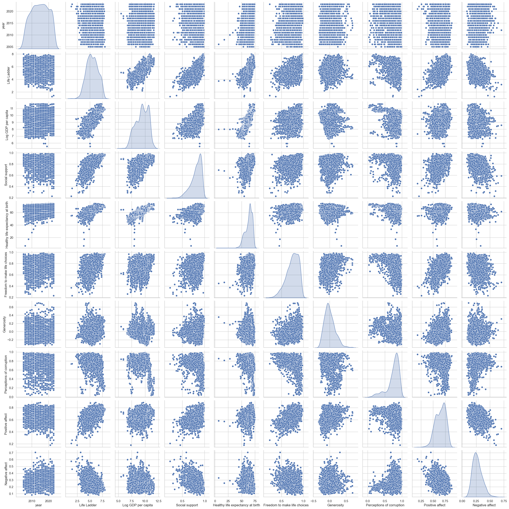
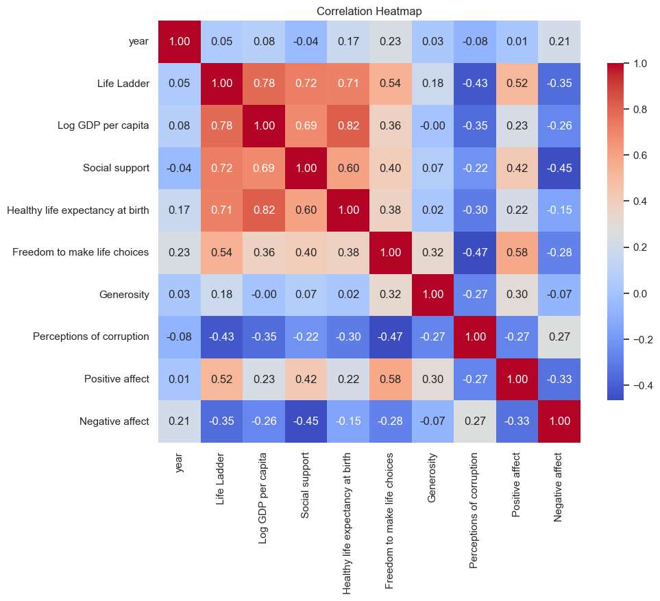
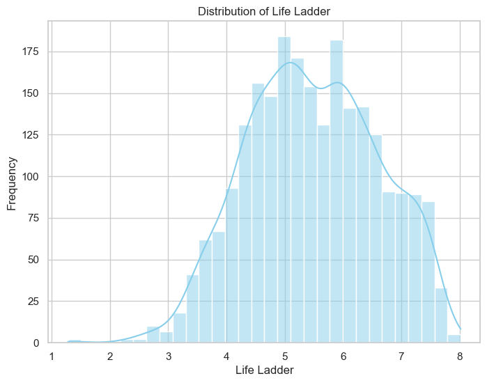
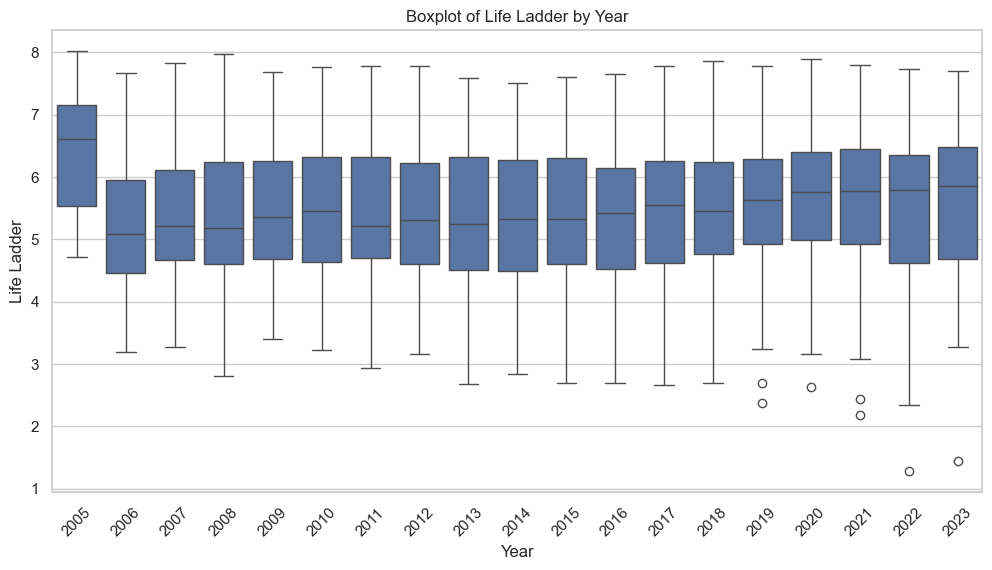
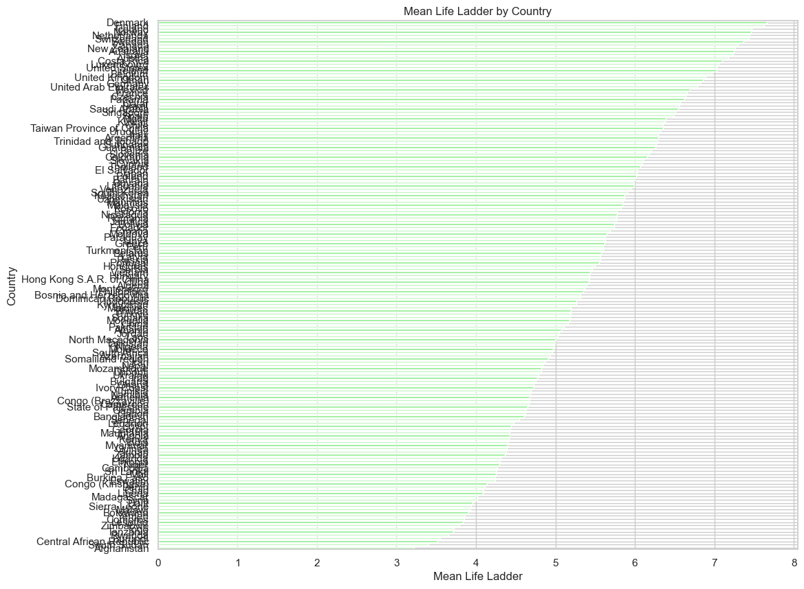
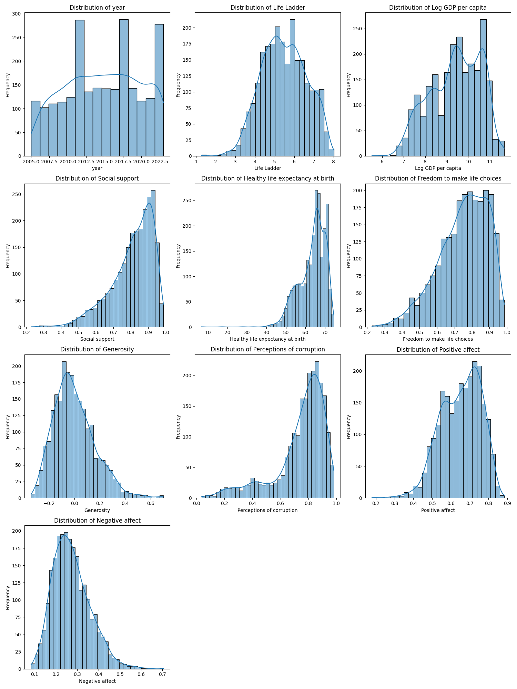

# 🤖 Automated Analysis Report

#### 📦 Column(s) Available 

`Country name`,`year`,`Life Ladder`,`Log GDP per capita`,`Social support`,`Healthy life expectancy at birth`,`Freedom to make life choices`,`Generosity`,`Perceptions of corruption`,`Positive affect`,`Negative affect` 

#### 🪫 Column(s) with Missing Values 

|                                  |   0 |
|:---------------------------------|----:|
| Log GDP per capita               |  28 |
| Social support                   |  13 |
| Healthy life expectancy at birth |  63 |
| Freedom to make life choices     |  36 |
| Generosity                       |  81 |
| Perceptions of corruption        | 125 |
| Positive affect                  |  24 |
| Negative affect                  |  16 |

## 💡 Story
### 🌍 Exploring Global Well-Being: A Data Story

In our quest to understand global happiness and quality of life, we analyzed a rich dataset that provides insights into various factors influencing well-being across 165 countries over multiple years. The dataset contains key indicators such as **Life Ladder**, **Log GDP per capita**, **Social support**, and more, allowing us to piece together the intricate puzzle of quality of life around the globe. Let's delve into the findings! 📊🔍

### 📅 Data Overview

The dataset spans **2005 to 2023**, offering insights into the well-being of various nations through metrics like life satisfaction and economic indicators. 

| **Statistic**                            | **Value**        |
|------------------------------------------|------------------|
| **Total Entries**                        | 2363             |
| **Unique Countries**                     | 165              |
| **Years Covered**                        | 2005 to 2023     |
| **Key Indicators**                       | 9 Metrics        |

### 📈 Summary Statistics

The average values reveal some interesting trends in well-being:

- **Life Ladder**: Average score of **5.48**, indicating moderate life satisfaction.
- **Log GDP per capita**: An average of **9.40** suggests decent economic prosperity.
- **Social Support**: An average of **0.81** showcases a general sense of community assistance.
- **Healthy Life Expectancy**: Average at **63.40** years reflects the health status of populations.

### 🔄 Missing Values

Before we dive deep, let's highlight where the data might be incomplete. Missing values can impact the analysis and conclusions we can draw. Here’s a brief look at the missing data:

| **Metric**                               | **Missing Values** |
|------------------------------------------|---------------------|
| Log GDP per capita                       | 28                  |
| Social support                           | 13                  |
| Healthy life expectancy                  | 63                  |
| Freedom to make life choices             | 36                  |
| Generosity                               | 81                  |
| Perceptions of corruption                | 125                 |
| Positive affect                          | 24                  |
| Negative affect                          | 16                  |

### 📊 Correlation Insights

Examining the correlations between variables sheds light on relationships that matter:

- **Life Ladder and Log GDP per capita**: A strong positive correlation of **0.78** indicates that economic prosperity significantly influences life satisfaction. 💰❤️
- **Social Support** and **Life Ladder**: A correlation of **0.72** suggests that a supportive community is essential for enhancing well-being. 👫💬
- **Perceptions of Corruption** & **Life Ladder**: A negative correlation of **-0.43** signifies that high corruption perceptions tend to lower life satisfaction. 🚫💼

### 🌈 Potential Insights

1. **Economic Prosperity Drives Happiness**: The data implies that nations with higher GDP per capita tend to have happier citizens. This highlights the importance of economic policies aimed at growth. 📈✨

2. **The Role of Social Connections**: Social support emerges as a crucial factor for well-being. Promoting community-centric programs could enhance happiness levels, showcasing the need for policies that encourage social bonding. 🤝💖

3. **Corruption Matters**: Countries perceived to have high corruption levels see a decline in happiness. This indicates the necessity for transparency and good governance to improve citizens' quality of life. 🌐🔍

### 🛠️ Data Types

- **Numeric Data**: 
  - Life Ladder
  - Log GDP per capita
  - Social Support
  - Healthy Life Expectancy
  - Freedom to make life choices
  - Generosity
  - Perceptions of corruption
  - Positive affect
  - Negative affect

- **Categorical Data**: 
  - Country name
  - Year

### 🚀 Conclusion 

This dataset paints a vibrant picture of the global landscape of happiness. By understanding the interconnectedness of economic indicators, social support systems, and governance, we can create more targeted interventions aimed at improving well-being globally. 🌍💪

Stay tuned for further insights as we continue to analyze and uncover the layers behind human happiness! 📚🔍

### 🌉 Visual Analysis 2.0 

### 🌉 Visualizations of Distribution 

